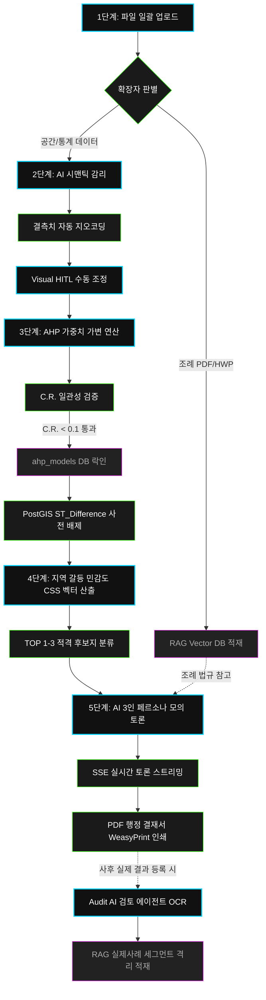

# 🎨 [시각화 가이드] OmniSite ERD, 아키텍처, 파이프라인 제작 명세서

본 문서는 발표 자료(PPT, 노션 등)에 삽입할 **1) E2E 파이프라인, 2) 시스템 아키텍처, 3) 물리 DB ERD**의 고해상도 이미지를 1초 만에 무료로 생성하고 편집할 수 있는 구체적인 소스코드와 툴킷 활용 가이드라인입니다.

---

## 🛠️ 1. 추천 다이어그램 제작 툴 & 1초 렌더링 꿀팁

AI 이미지 생성기(DALL-E 등)로 다이어그램을 그리면 글자가 뭉개지거나 깨집니다. 아래의 **텍스트 기반 다이어그램 도구**를 사용해 SVG/PNG 고해상도 벡터 그래픽으로 내보내시는 것이 가장 전문적입니다.

1.  **[강력 추천] Eraser.io (무료 AI 다이어그램 툴)**
    *   [Eraser.io](https://www.eraser.io/) 접속 ➔ `New File` 생성 ➔ 좌측 사이드바 `Diagram as Code` 선택 ➔ 아래의 **Mermaid 코드**를 그대로 복사-붙여넣기하면 고급스러운 그라데이션이 들어간 다이어그램이 즉시 자동 생성됩니다.
2.  **Mermaid Live Editor (오픈소스 뷰어)**
    *   [Mermaid Live Editor](https://mermaid.live/) 접속 ➔ 좌측 `Code` 입력창에 아래 코드를 넣으면 즉시 PNG/SVG 파일로 해상도 깨짐 없이 다운로드할 수 있습니다.

---

## 🔄 2. 5단계 E2E 파이프라인 다이어그램 (Mermaid Code)

사용자의 파일 업로드부터 RAG R&D 적재, 모의 토론, 피드백 루프까지 이어지는 전체 워크플로우의 순서도입니다.



---

## 🌐 3. 시스템 아키텍처 구성도 (Eraser.io Premium Code)

단일 이원화 통신 병목을 해결한 Next.js - FastAPI Monolith - AWS EKS 아키텍처 구조도입니다.

```text
// OmniSite E2E Architecture Diagram (Eraser.io Premium Syntax)

// Set the layout flow for maximum readability in slide shows
direction: left-to-right

group Client_Presentation [color: blue, icon: chrome, label: "Presentation Layer"] {
  NextJS [icon: nextjs, label: "Next.js Web Frontend"]
  Mapbox [icon: mapbox, label: "Mapbox GL JS Map View"]
}

group FastAPI_Monolith_Backend [color: green, icon: fastapi, label: "FastAPI Core Backend Engine"] {
  FastAPI [icon: fastapi, label: "FastAPI API Server"]
  LangGraph [icon: python, label: "LangGraph Multi-Agent RAG"]
  WeasyPrint [icon: pdf, label: "WeasyPrint PDF Generator"]
}

group Data_Storage [color: purple, icon: database, label: "Storage Layer"] {
  PostGIS [icon: postgresql, label: "PostgreSQL / PostGIS DB"]
  VectorDB [icon: database, label: "Vector RAG Store (Chroma)"]
}

// E2E Data Flows with custom line styling and color mapping
NextJS > FastAPI : "1. CSV/PDF 일괄 업로드" [color: blue, line: solid]
NextJS > FastAPI : "2. AHP 슬라이더 가중치" [color: blue, line: dashed]
Mapbox > FastAPI : "3. Visual HITL 핀 보정 API" [color: blue, line: dotted]

FastAPI > PostGIS : "4. ST_Difference 공간 연산" [color: green, line: solid]
FastAPI > VectorDB : "5. 조례 RAG 유사도 검색" [color: green, line: dashed]
LangGraph > FastAPI : "6. GPT-4o 3자 모의 토론" [color: red, line: solid]

FastAPI > NextJS : "7. SSE 실시간 토론 스트리밍" [color: red, line: solid]
FastAPI > WeasyPrint : "8. HTML-to-PDF 컴파일" [color: gray, line: dashed]
WeasyPrint > NextJS : "9. 행정 보고서 PDF 다운로드" [color: gray, line: solid]
```

---

## 🗄️ 4. 13종 물리 DB 스키마 ERD 관계도 (Mermaid Code)

공간 데이터 타입(Geometry)과 GIST 인덱스가 매핑된 PostgreSQL/PostGIS 데이터 모델링 릴레이션 다이어그램입니다.

```mermaid
erDiagram
    districts ||--o{ nosmoking_zones : "has"
    districts ||--o{ childcare_centers : "has"
    districts ||--o{ transit_stations : "has"
    districts ||--o{ dong_boundaries : "has"
    districts ||--o{ commercial_shops : "has"
    districts ||--o{ cadastral_lands : "has"
    districts ||--o{ trash_bins : "has"
    districts ||--o{ cigarette_dumping_zones : "has"

    districts {
        SERIAL id PK
        VARCHAR district_name "구역명"
        VARCHAR sig_cd UK "시군구코드"
    }

    nosmoking_zones {
        SERIAL id PK
        INT district_id FK
        VARCHAR zone_name
        GEOMETRY geom "GIST Index (Point)"
    }

    childcare_centers {
        SERIAL id PK
        INT district_id FK
        VARCHAR center_name
        VARCHAR center_type
        GEOMETRY geom "GIST Index (Point)"
    }

    transit_stations {
        SERIAL id PK
        INT district_id FK
        VARCHAR station_no
        VARCHAR station_name
        VARCHAR transit_type
        GEOMETRY geom "GIST Index (Point)"
    }

    dong_boundaries {
        SERIAL id PK
        INT district_id FK
        VARCHAR dong_code
        VARCHAR dong_name
        GEOMETRY geom "GIST Index (MultiPolygon)"
    }

    commercial_shops {
        SERIAL id PK
        INT district_id FK
        VARCHAR shop_name
        VARCHAR category_name
        GEOMETRY geom "GIST Index (Point)"
    }

    cadastral_lands {
        SERIAL id PK
        INT district_id FK
        VARCHAR pnu
        VARCHAR land_use_code "지목"
        GEOMETRY geom "GIST Index (Polygon)"
    }

    trash_bins {
        SERIAL id PK
        INT district_id FK
        GEOMETRY geom "GIST Index (Point)"
        VARCHAR bin_type
    }

    cigarette_dumping_zones {
        SERIAL id PK
        INT district_id FK
        GEOMETRY geom "GIST Index (Point)"
    }
```



---

## 🖼️ 5. [추가 선사] 고해상도 대시보드 Mock-up 이미지 활용
*   발표자료 표지나 디자인 콘셉트 장표에 바로 삽입하여 사용하실 수 있도록, OmniSite의 프리미엄 다크/네온 테마 UI 대시보드 그래픽을 미리 생성해 로컬 폴더에 복사해 두었습니다.
*   **이미지 파일 경로:** [`omnisite_dashboard_mockup.png`](file:///Users/jcm0314/Downloads/빅프로젝트/omnisite_dashboard_mockup.png)
*   **비주얼 구성 요소:** 용산구 3D GIS 공간 지도, Layer 패널, 우측 AI 3인 대리인 모의 토론 실시간 중계창 및 하단 AHP 가중치 데이터 시각화 도표가 E2E 프리미엄 프로토타입 디자인으로 구현되어 있습니다.
