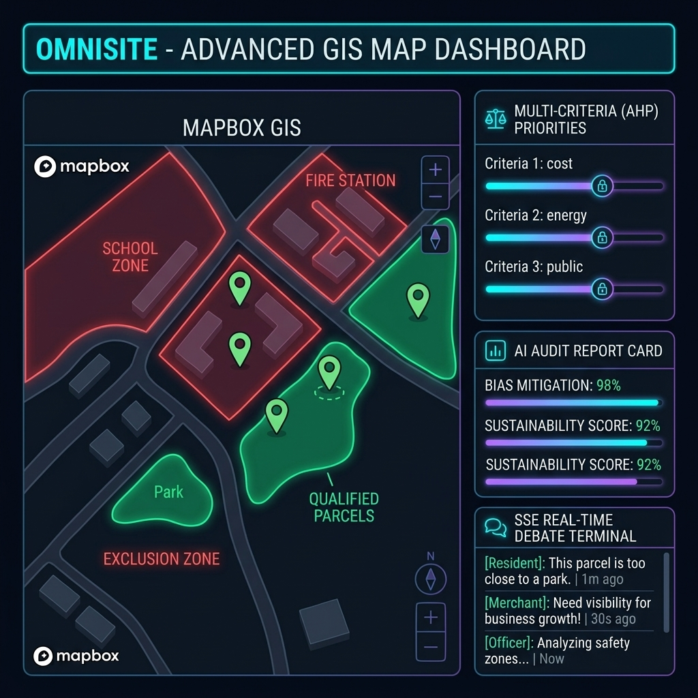

# 🛡️ 스마트시티 SDSS 플랫폼 "OmniSite" 최종 과제 정의서 (Project Definition Sheet)

## 👥 조원 성명 (조장을 맨 앞에)
*   **배종현 (조장)**: 기획 총괄, 공공 데이터 수집 및 데이터 가공 가이드라인 수립
*   **김규민**: 백엔드 인프라 설계, DB 스키마 구축 및 쿼리 최적화
*   **김혜성**: GIS 레이어 설계 및 지도 기반 시각화 연동
*   **박민영**: 프론트엔드 UI/UX 설계 및 대시보드 컴포넌트 개발
*   **이동현**: AI 모델 탐색 및 RAG 지식베이스 설계
*   **장천명 (TL)**: 풀스택 E2E 연동, 실시간 SSE 스트리밍 및 공간 차집합 연산 파이프라인 구현
*   **정찬진**: 백엔드 API 라우터 구현 및 보안 인증/인가(JWT, Bcrypt) 시스템 개발
*   **최승헌**: 사후 Audit AI 검증 엔진 및 OCR 파싱 모듈 설계

---

## 🏷️ 과제명
**지능형 다목적 스마트시티 입지 선정 및 공공갈등 예측 플랫폼 "OmniSite"**

---

## 1. ⚙️ 주요 서비스 내용 (주요 기능, 기술 포함)

### 📊 OmniSite 통합 의사결정 대시보드 시안 (비주얼 가이드)

### 💻 서비스 주요 기능 (웹 서비스)

1.  **일괄 통합 드래그앤드롭 및 AI 사전 감리 (Unified Ingestion & Audit)**:
    *   *기능*: 비전공자 실무자(공무원)가 도시 인프라 관련 수치 통계(다중 CSV)를 단 하나의 드롭존에 일괄 드래그앤드롭하여 업로드합니다.
    *   *AI 사전 감리*: OpenAI GPT-4o-mini API를 비동기 가동하여 위경도 결측 오차를 검리하고 감리 사유(`audit_reason`), 탐색 의도(`user_intent`), 융합 가중치 요인들을 즉각 요약 추출합니다.
    *   *보안/격리 가드*: 추출된 모든 기획 데이터는 보안 규정에 따라 **오직 프론트엔드 상태(Client React State)로만 격리 보존**하여 DB 유출을 원천 차단하며, RAG 법규용 PDF는 독립적인 관리 모달로 가드를 분리합니다.
2.  **공간 배제 마스크 시각화 프리뷰 (Exclusion Mask Preview)**:
    *   *기능*: PostGIS 연산을 통해 법률 및 조례에 규정된 모든 제한 구역(예: 스쿨존 200m, 지하철역 30m, 소방시설 10m 등)을 병합한 반투명 적색 배제 마스크(Exclusion Mask)와 설치 가능 후보 필지(Green)를 Mapbox 지도에 실시간 오버레이 렌더링합니다.
    *   *영향권 매핑*: 선택된 후보 필지를 중심으로 파란색 점선 원형 배후 영향권(150m)을 실시간 매핑하여 최적 접근성을 입증합니다.
3.  **지도 기반 비주얼 HITL 조정 및 의도 편집 (Hybrid HITL)**:
    *   *기능*: AI 지오코딩 오차가 의심되는 좌표 핀에 대해 실무자가 지도 화면에서 마우스 드래그앤드롭으로 직접 좌표를 정정하고, AI 도출 '탐색 의도' 텍스트를 실무에 맞게 정정한 뒤 **단 하나의 Commit**으로 DB와 로컬에 동시 확정하는 하이브리드 피드백 루프를 가동합니다.
    *   *복원 가드*: 마커 드래그 중 어린이보호구역이나 소방시설 금역 반경을 침범할 경우, 마커가 `⚠️` 경고 아이콘으로 실시간 변환 및 물리 원위치 복원(Rollback) 가드가 작동합니다.
4.  **AHP 일관성 검증 및 영구 모델 락 (AHP Lock)**:
    *   *기능*: 입지 선정을 위해 Step 1에서 AI가 동적으로 도출한 가중치 요인 명세를 슬라이더 UI에 가변 매핑 렌더링하고, 1~9점 척도의 가중치 쌍대비교 슬라이더 조작을 제공합니다.
    *   *정합성*: 슬라이더 값 변경 즉시 일관성 비율(C.R. < 0.1) 수학적 정합성을 자동 검증하며, 검증 통과 시 테이블에 영구 락(Lock)을 걸어 의사결정 조작(게리맨더링) 시비를 차단합니다 (🔓 Unlock UI로 재수정 가능).
5.  **온디맨드 실시간 AI 시나리오 중계 (SSE Stream)**:
    *   *기능*: AHP 가중치 합산 Top 1 부지에 대해 주민대표(반대 NIMBY), 상인대표(찬성), 조정 공무원(중재) 간의 LangGraph 3자 가상 토론을 자동 기동하고, 토론 내용을 SSE(Server-Sent Events) 스트리밍을 통해 실시간 터미널 형식 한글 자동 스크롤 중계합니다.
    *   *비용 절감 (Cost Guard)*: 무거운 토론 연산은 Top 1 부지만 자동 실행하며, Top 2 & 3은 사용자가 명시적으로 선택 클릭할 때에만 비동기 호출하게 하여 불필요한 API 요금 발생을 원천 차단합니다.
6.  **타당성 보고서 컴파일 및 사후 피드백 루프 (Deletion Engine)**:
    *   *기능*: WeasyPrint 기반의 도로점용료 등 법적 산식이 바인딩된 정식 행정 타당성 분석 보고서 PDF 인쇄 다운로드를 제공합니다.
    *   *사후 환류*: 실제 준공 공문서(PDF) 업로드 시 Audit AI가 OCR 파싱 분석을 거쳐 기존 3대 시나리오에 1:1 자동 매핑하되, RAG 피드백 오염(Model Collapse) 방지를 위해 공문서 및 RAG 텍스트 캐시 물리 동시 삭제 엔진(Deletion Engine)과 이력 데이터 격리 적재 테이블을 가동합니다.
7.  **도시행정망 실무자 인증 및 세션 가드 (JWT & Bcrypt Security)**:
    *   *기능*: 구청 실무자 및 관리자 세션 보호를 위한 OAuth2 비밀번호 암호화(Bcrypt) 기반 회원가입(`POST /auth/register`) 및 JWT 토큰 기반 로그인(`POST /auth/login`) API의 E2E 실물 연동.
    *   *성능 가드*: Bcrypt 해싱 연산의 CPU-bound 자원 병목을 방지하기 위해 FastAPI 이벤트 루프 외부에 있는 **별도 작업 스레드 풀(Thread Pool Executor)로 안전하게 격리 처리**하여 전체 서버 동시성을 보장합니다.

---

### 🧠 AI 및 공간정보 기술

1.  **Spatial AI & Geo-Intelligence (PostGIS Engine)**:
    *   PostGIS 공간 인덱스(GIST)와 `ST_Difference` 및 `ST_Union` 공간 기하 연산을 적용하여, 대용량 지적도 데이터셋에서도 **0.3초 이내**에 법규 위반 필지를 정밀하게 도려내어 적격 필지만 선별.
2.  **Multi-Agent RAG Orchestrator (LangGraph & pgvector)**:
    *   자치구 공공 인프라 관련 조례 전문이 청킹 임베딩된 pgvector 벡터 DB를 기반으로 찬성 주민대표, 반대 상인대표, 구청 공무원 에이전트가 모의 심의 토론을 벌이는 멀티 에이전트 설계.
    *   **다이나믹 라우팅**: 고정된 순서 없이 `supervisor` 노드가 문맥을 파악하여 다음 발화 페르소나를 결정하며, 최대 3라운드 제한 및 수용도(`officer_acceptance` >= 0.8) 만족 시 조기 종료 가드 탑재.
3.  **Explainable Recommendation (XAI)**:
    *   입지 추천 점수 기여도(유동인구 통계, 민원 빈도, 배후 인프라 밀도 등)의 영향력을 차트와 자연어 행정 보고서 서식으로 번역 제공하여 대외적 투명성 확보.
4.  **AHP 일관성 검증 알고리즘 (N x N Spec)**:
    *   동적 가중치 도출 개수에 따라 $N \times N$ 상대 행렬 크기를 가변 조정하여 일관성 지표(C.R. < 0.1)를 수학적으로 연산하고 저장 및 락(Lock) 상태를 통제하여 통계적 정합성 획득.
5.  **데이터 감리 및 규제 교차 검증 LLM (RAG Audit)**:
    *   업로드된 정형 파일의 결측 항목을 분석하는 데이터 감리와, 조례집에서 탐지된 법적 제약 조건(예: '보호구역 200m 이내 설치 불가')에 대응되는 GIS 데이터 레이어가 누락되었을 시 알람을 주는 교차 검증 기술.

---

## 2. 🎯 목표 고객 (B2G 및 B2B 상세 타겟팅)

### 🏢 ➊ B2G (Business-to-Government) - 핵심 타겟
*   **주요 고객**: 전국 지방자치단체(시·군·구청)의 인프라 기획 및 주민 갈등 조율 부처 전반.
*   **세부 타겟별 페르소나 및 페인 포인트**:
    1.  **행정 실무 부서 실무자 (도시계획과, 도로교통과, 환경과, 복지지원과 등)**:
        *   *Pain Point*: 편익 및 기피 시설(전기차 충전소, 흡연부스, 실버쉼터 등) 설치 시, 법적 저촉 구역을 사전에 확인하기 위해 수많은 조례 문서를 수동으로 대조해야 하고, 인근 주민들의 극심한 NIMBY 반대로 인해 설명회 조율 및 예산 집행이 수개월에서 수년간 표류하는 어려움을 겪음.
        *   *도입 가치*: 드래그앤드롭 한 번으로 위경도 오차와 법규 제한 사항을 0.3초 만에 자동 필터링(Exclusion Mask)하고, 주민-상인 모의 토론을 가동해 예상 민원과 중재안을 선제 입증함.
    2.  **지방자치단체 의사결정권자 (구청장, 시·구의회 의원 등)**:
        *   *Pain Point*: 입지 선정의 정당성 확보가 어려워, 인근 주민이나 반대 단체로부터 특정 부지 밀어주기(게리맨더링) 시비나 자의적 조작 감사 청구 소송에 휘말릴 리스크를 안고 있음.
        *   *도입 가치*: AHP 가중치 정합성 검증 만족 시 모델을 영구 잠금(Lock)하여 조작 가능성을 차단하고, 투명한 XAI 점수 기여도 리포트를 제공하여 행정 신뢰성(투명성)을 확보함.

### 🏭 ➋ B2B (Business-to-Business) - 확장 타겟
*   **주요 고객**: 공공 인프라를 대행 설계하는 민간 엔지니어링 기업 및 위탁 운영사.
*   **세부 타겟별 페르소나 및 페인 포인트**:
    1.  **도시계획 및 환경영향평가 용역 대행사 (GIS 용역사, 설계 엔지니어링 기업)**:
        *   *Pain Point*: 공공 입찰을 수주한 뒤 타당성 조사 보고서와 지리 분석 도면을 작성할 때, 자치구별 수천 페이지의 규제 조례집을 수동 분석하고 CAD 도면을 일일이 매핑해야 하여 과도한 기술 노임(인건비) 및 기간 소모.
        *   *도입 가치*: PostGIS 공간 차집합 자동화와 WeasyPrint 기반의 행정 타당성 분석서(PDF) 자동 컴파일 아웃풋을 기용해 조사 용역 공수를 90% 이상 획기적으로 다이어트함.
    2.  **민간 인프라 구축·운영 기업 (전기차 충전 서비스 제공사(CPO), 스마트 쉼터/부스 시공사 등)**:
        *   *Pain Point*: 지자체와 협의 하에 인프라를 완공했으나, 사후 소방법 위반이나 인근 초등학교 학부모 단체의 민원 소송 제기로 인해 완공된 시설을 강제 철거 및 이전해야 하는 막대한 재정 손실 리스크 상존.
        *   *도입 가치*: 기획 단계에서 합법적이고 민원이 최소화될 입지를 선제 시뮬레이션함으로써 투자 안정성을 담보함.

---

## 3. 💡 과제 선정 배경

### ➊ 공공 시설물 건립 시 NIMBY 갈등 급증과 행정 비용 소모 (사회적 배경)
*   **생활 밀접 기피·편익 시설 설치의 갈등 심화**: 스마트 흡연부스, 전기차 충전소, 실버 쉼터 등 필수 공간 인프라 건립 시, 인근 주민들의 주거권 침해 주장과 주변 상인들의 영업권 옹호 간의 이권 충돌로 인해 공공 갈등이 기하급수적으로 발생하고 있음.
*   **사회적 합의 비용의 낭비**: 이를 중재하기 위해 수개월간 서면 공청회와 물리적 대면 설명회를 공회전시키며 소모되는 행정력 낭비와, 합의 지연에 따른 공공 안전 인프라의 적기 도입 실패 등 보이지 않는 사회적 손실이 극심함.

### ➋ 기존 SDSS(공간의사결정지원시스템)의 임계점 및 오설치 사고 (기술적 배경)
*   **수작업 검증의 한계**: 기존의 지리정보 분석 방식은 공무원이 조례집 법구를 보고 수작업으로 지형도를 대조하다 보니, 어린이 보호구역(학교 200m, 어린이집 30m) 등 법적 제한 규정을 누락하여 불법적으로 시설물을 건립하는 **행정 오설치 사고**가 지속적으로 터짐.
*   **재정적 매몰 손실 및 소송 리스크**: 완공 후 위법성이 지적되어 철거 및 강제 이전을 당할 때 발생하는 개당 1,500만 원~2,500만 원 선의 세금 매몰 손실과 주민 행정소송 비용이 심각한 리스크로 작용함.
*   **자의적 조작(게리맨더링) 취약성**: 기존 시스템은 담당 실무자가 사후에 특정 부지를 밀어주기 위해 임의로 의사결정 가중치를 수정하거나 조작하는 의혹을 가드할 통계적 통제 장치(Lock)가 전무하여 행정 불신을 조장함.

### ➌ 부서별 예산 파편화와 다목적 확장성의 결 부재 (행정적 배경)
*   **칸막이 행정에 따른 중복 개발 예산 낭비**: 전기차 충전소는 도로교통과, 흡연부스는 보건소, 스마트 쉼터는 복지과 등 주무 부처가 다를 때마다 매번 수억 원의 세금을 들여 개별 시스템을 중복 신규 발주하는 **국가적 예산 파편화(중복 투자)**가 고질적으로 상존함.
*   **도메인 독립 범용 플랫폼의 부재**: 국토부 기본 지적도 공간 정보 위에 실무 데이터셋과 의사결정 가중치(AHP) 프로파일만 스왑(Swap)하여 다목적으로 즉시 사용 가능한 범용 플랫폼의 수립이 매우 절실함.

---

## 4. 📊 활용 데이터 (정제데이터 완성본 실물 데이터셋 규격)

### ➊ 공간 부지 후보지 및 법적 규제 영역 데이터 (공통 기본 GIS 레이어)
1.  **공간 지적도 후보지 데이터 (`05.용산구_부지면적_좌표(흡연부스 후보).csv` - 3.2MB)**:
    *   *내용*: 용산구 연속지적도(LSMD) 기반으로 `[경도, 위도]` 지리 공간 좌표를 바인딩하고 불필요한 `[지목코드]` 등을 소거하여, PostGIS가 고속 차집합(Exclusion Mask) 연산을 할 수 있도록 정제한 **입지 적격 필지 후보군**.
2.  **공간 금역 규제 구역 데이터 (`06.07 금연구역 통합본.csv` - 53.9KB)**:
    *   *내용*: 어린이보호구역(스쿨존), 어린이집, 학교 위치정보 및 기존 금연구역 조례 지정 범위를 통합 정제.
    *   *스키마*: `[시설이름, 시설종류, 주소, 경도, 위도, 지정범위기준]`으로 칼럼 형식을 단일 표준화하여 공간 제외 연산 시 충돌 방지.
3.  **기존 흡연구역 마스터 데이터 (`09.서울특별시 용산구_흡연구역.csv` - 4.8KB)**:
    *   *내용*: 기 설치된 지자체 실외 흡연구역 위치 정보에 `[경도, 위도]` 좌표 정보를 지오코딩으로 추가 보정 완료.

### ➋ 실시간 유동/생활인구 수요 데이터 (B2G/B2B 입지 평가 데이터셋)
1.  **버스정류소 유동 거점 데이터 (`00.버스정류소_위치.csv` & `01.버스정류소_유동인구.csv` - 40.1KB)**:
    *   *내용*: 대중교통 거점 혼잡 지표 분석용 데이터셋.
    *   *스키마*: `[표준버스정류장ID, 정류소명, 경도, 위도, 월평균승객수]` 기준으로 정제하여 승하차 수요 점수와 지리적 버퍼 연산에 직접 활용.
2.  **도시철도 거점 데이터 (`02.지하철_출입구_위치.csv` & `03.지하철역_유동인구.csv` - 3.5KB)**:
    *   *내용*: 지하철역 각 출입구 번호별 `[경도, 위도]` 물리 좌표 및 이용객 유동 유입 밀도 정제.
3.  **행정동별 실시간 생활인구 (`04.생활인구.csv` - 365.9KB)**:
    *   *내용*: 공공 실외 흡연구역 설치 시 성인 인구 밀집 구역에 가점을 주는 의사결정 논리를 위해, 생활인구 총합을 **`[미성년자 총인구수]`와 `[성인 총인구수]`로 연령별 분리 가공**.

### ➌ 민원, 시설물 및 배후 상권 데이터 (수요 및 관리 지표)
1.  **담배꽁초 상습 무단투기 민원 (`07.담배꽁초_상습_무단투기.csv` - 874B)**:
    *   *내용*: 용산구 관내 주요 담배꽁초 민원 빈발 지역 위치정보에 대한 결측 좌표 교정.
2.  **공공 가로 가로휴지통 위치 (`11.G1_서울특별시 용산구_가로휴지통_geocoded.csv` - 19.1KB)**:
    *   *내용*: 쓰레기 수거 및 흡연구역 사후 관리를 위한 가로휴지통 위치에 `[경도, 위도]` 좌표 매핑 완료.
3.  **소상공인 배후 상권 상업 데이터 (`10.소상공인시장진흥공단_상가_YONGSAN.csv` - 2.7MB)**:
    *   *내용*: 흡연부스 설치 시 상인회와의 갈등 또는 영업 활성화 기여도 산출용 상권 데이터.
    *   *스키마*: `[상호명, 상권업종분류명, 표준산업분류명, 도로명주소, 경도, 위도]`만 남기고 노이즈 칼럼 소거.

### ➍ 자치 조례집 및 실제 행정 판례 데이터 (RAG & Audit)
*   **자치 조례 RAG**: 용산구 도로 점용 조례, 금연구역 지정 조례, 소방시설 설치 조례 등 전문 HWP/PDF.
*   **사후 감사 precedent RAG**: 지자체 위원회 실제 합의 판결문 및 준공 검사 공문서 OCR 추출본.

---

## 5. 📈 기대 효과 (3대 관점의 행정·사회·기술 가치)

### ➊ 기술적 관점 (Engineering & Spatial Tech Value)
*   **공간 규제 검증 속도 98% 가속화**: 수작업으로 지도를 대조하던 방식 대비, PostGIS 공간 인덱스(GIST)와 차집합 기하 연산을 적용하여 **0.3초 이내**에 전국 수십만 필지 중 합법적이고 무결한 적격 부지만 자동 추출.
*   ** RAG 기반의 무결한 법적 조례 검합성**: 지자체 자치 규칙 전문 RAG 및 AI 사전 감리 교차 검증을 통해, 학교보호구역이나 금연 구역 위반 등 수작업 필터링 시 발생하는 휴먼 에러(행정 오기)를 완전히 예방.
*   **설명 가능한 입지 추천(XAI)의 객관성**: 입지 추천 결과만 던지는 블랙박스 연산이 아닌, 인자별 점수 기여도를 시각 차트와 자연어 해설로 번역 제공하여 추천 정당성의 기술적 투명성 확보.

### ➋ 행정적 및 재정적 관점 (Administrative & Fiscal Value)
*   **다부서 의사결정 기간 96.7% 단축**: 부서 간 오프라인 서면 협의와 대면 설명회 준비에 평균 **30일**이 소요되던 업무 소요 기간을, RAG 조례 및 예측 시나리오가 탑재된 AI 3자 토론을 통해 **1일 이내**로 획기적으로 줄여 행정 기동성 극대화.
*   **시설 오설치 예산 매몰 손실 0원 달성**: 위법 부지 내 인프라 무단 건립으로 발생하는 사후 강제 철거 및 재시공 비용(개당 1,500만 원~2,500만 원 매몰 손실)과 관련 행정소송 비용을 기획 단계의 철저한 규제 필터링으로 0% 차단.
*   **지자체 플랫폼 구축 비용 90% 세이브 (OmniSite)**: 도메인 전환 시 매번 수억 원의 솔루션 신규 용역 개발비를 들일 필요 없이, 현업 담당자가 노코드로 데이터셋과 AHP 가중치 프로파일을 스왑하는 것만으로 **전환성 90% 이상**을 달성해 국가적 예산 낭비를 원천 해결.

### ➌ 사회적 및 대민 신뢰 관점 (Social Consensus & Public Trust Value)
*   **공공 갈등(NIMBY) 예방 및 주민 설득의 객관적 무기**: AI 토론에서 도출된 상생 조율안과 조례 원문 링크(제N조 N항)가 바인딩된 행정 타당성 보고서(PDF)를 출력해 주민설명회 및 의회 설득 단계에서 강력한 팩트 근거로 활용하여 갈등 타결률 극대화.
*   **가중치 임의 조작(게리맨더링) 차단**: AHP 가중치 수학적 일관성 비율(C.R. < 0.1) 만족 시 의사결정 모델을 영구 잠금(Lock) 처리하여, 사후적으로 특정 부지를 밀어주기 위해 공무원이 점수를 조작하는 행정 불신을 완벽히 제거.
