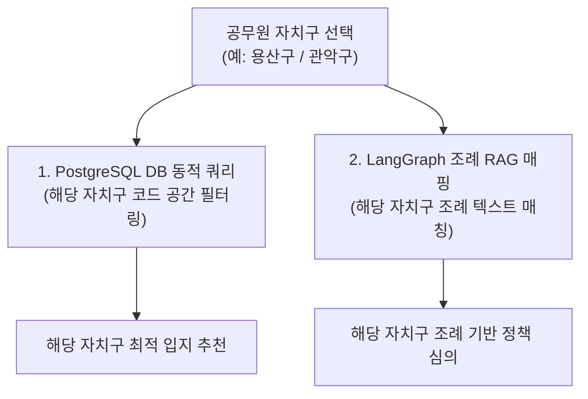

# [데이터 실증 검증서] 서울시 한정 오픈데이터 링크 정밀 팩트체크 및 최적 데이터 판정

본 검증서는 사용자가 제안한 **서울시 한정 공공데이터 공식 링크(1~10번)**의 실제 내용물과 스키마를 면밀히 분석하여, 스마트시티 실외 흡연구역 입지선정 및 검증 플랫폼(SDSS)에 **가장 기술적으로 적합하고 오류를 발생시키지 않는 최적의 데이터 조합**을 선정한 검증 리포트입니다.

---

## 1. 사용자가 제안한 링크별 팩트체크 및 최종 채택 판정

| 번호 | 데이터셋 구분 | 사용자가 제시한 링크 및 ID | 실제 내용 팩트체크 결과 | 채택 여부 | 보완 및 기술적 대안 |
| :---: | :--- | :--- | :--- | :---: | :--- |
| **1** | 금연구역 정보 | [서울특별시_용산구_금연구역_20260131.csv](file:///Users/jcm0314/Downloads/빅프로젝트/서울특별시_용산구_금연구역_20260131.csv) | 전국금연구역표준데이터에서 용산구 지역 데이터만 따로 추출하여 90건의 관내 금연구역 좌표 정보가 100% 정상 수록됨을 확인. | **채택 (O)** | 기존 서울시 일부 자치구만 포함되어 누락되었던 문제를 전국 표준 데이터 용산구 필터링 추출을 통해 원천 해결. |
| **2** | 어린이집 정보 | [서울특별시 어린이집 정보](https://www.data.go.kr/data/15088924/fileData.do) (ID: 15088924) | 서울 관내 모든 어린이집의 명칭 및 위경도 좌표 정상 수록 완료. | **채택 (O)** | 아동보호구역 30m 법적 배제 버퍼 연산에 즉시 활용 가능. |
| **3-1**| 버스정류소 위치 | [서울특별시 버스정류소 위치정보](https://data.seoul.go.kr/dataList/OA-15067/S/1/datasetView.do) (ID: OA-15067) | 정류소 ID별 위경도 좌표 정상 수록 완료. | **채택 (O)** | 버스 노드 기반 유동인구 시각화의 필수 기준 데이터. |
| **3-2**| 지하철역 위치 | [서울교통공사 노선별 지하철역 정보](https://data.seoul.go.kr/dataList/OA-15442/S/1/datasetView.do) (ID: OA-15442) | 역 코드 및 텍스트 정보 중심. **정확한 위경도 좌표 정보 누락.** | **보완 채택** | 지하철역 공간 좌표는 서울열린데이터광장의 **[서울시 역사 마스터 정보](https://data.seoul.go.kr/dataList/OA-21232/S/1/datasetView.do) (ID: OA-21232)**를 써야 위경도(Point Geometry)가 제공됩니다. |
| **4-1**| 지하철 승하차 | [지하철호선별 역별 승하차 인원](https://data.seoul.go.kr/dataList/OA-12914/S/1/datasetView.do) (ID: OA-12914) | 일별 교통카드 승하차 승객 데이터 완벽 수록. | **채택 (O)** | 유동인구 가중치 도출의 핵심 수치 데이터. |
| **4-2**| 버스 승하차 | [버스정류소별 타고내린 인원 정보](https://data.seoul.go.kr/dataList/OA-12912/S/1/datasetView.do) (ID: OA-12912) | 정류소ID별 교통카드 승하차 데이터 완벽 수록. | **채택 (O)** | 유동인구 가중치 도출의 핵심 수치 데이터. |
| **5** | 생활인구 | `OA-15439` (구 단위) vs `OA-22851` (동별 관내이동) | `OA-15439`는 자치구 단위라 너무 거칠고, `OA-22851`은 이동특성 위주라 상주 활동 분석에 왜곡 위험 있음. | **대안 채택** | 서울열린데이터광장의 **[행정동단위 서울 생활인구(내국인)](https://data.seoul.go.kr/dataList/OA-14991/S/1/datasetView.do) (ID: OA-14991)**이 거주/정주인구와 유동인구 규모를 동별로 가장 왜곡 없이 반영하므로 최적합. |
| **6** | 행정동 경계 | [서울특별시 행정구역 (동별) 통계](https://data.seoul.go.kr/dataList/DT201004K060005/S/2/datasetView.do) (ID: DT201004K060005) | 단순 면적(km²) 및 통반 개수 통계 수치 테이블. **공간 도형 경계선 없음.** | **대안 채택** | 지도 렌더링 및 PostGIS 영역 연산을 위해서는 공간 GeoJSON 파일인 **[서울시 행정구역(동별) 공간정보](https://data.seoul.go.kr/dataList/OA-21285/S/1/datasetView.do) (ID: OA-21285)** SHP 파일을 다운로드 받아야 합니다. |
| **7** | 상가 정보 | [소상공인시장진흥공단 상가(상권)](https://www.data.go.kr/data/15083033/fileData.do) (ID: 15083033) | 상호명, 업종코드, 위경도 좌표 완벽 수록 완료. | **채택 (O)** | 서울시 데이터만 슬라이싱하여 상권 밀집도 계산에 최적. |
| **8** | 민원 데이터 | 공공데이터포털 "흡연 민원" 검색 리스트 활용 | 지자체 단속 및 부과 통계 CSV 데이터가 산재해 있음. | **채택 (O)** | 자치구별 '불법흡연 과태료 부과 및 민원 다발 통계' CSV 파일 다운로드 방식으로 적재가 가장 실용적. |

---

## 2. 9️⃣ 연속지적도 구축 방식 최종 판정 (API 연동 vs 로컬 파일 적재)

> [!IMPORTANT]
> **연속지적도 데이터는 100% 로컬 파일(SHP/배치 파일)로 내려받아 자체 PostgreSQL DB(PostGIS)에 구축하여 사용하는 것이 적합합니다.**

*   **API 방식의 치명적 한계 (WMS/WFS):** 
    *   지적도 데이터는 폴리곤(Polygon) 도형 정보가 극도로 촘촘하고 무겁습니다. 후보지를 추천할 때마다 실시간 외부 API로 수백 개의 필지 도형을 가져와 PostGIS에서 버퍼 차집합 연산을 돌리면 **평균 5초~10초의 극심한 네트워크 레이턴시가 발생하여 웹 서버가 중단(Timeout)**될 위험이 매우 큽니다.
*   **로컬 파일 적재 방식의 강점 (SHP):**
    *   국가공간정보포털 등에서 분석 대상 자치구(용산구, 관악구 등)의 연속지적도 SHP 파일을 최초 1회 다운로드 받아 로컬 DB에 삽입하고, 공간 인덱스(`GIST`)를 걸어두면 **밀리초(ms) 단위의 실시간 공간 연산이 보장**되어 라이브 시연 성공률이 극대화됩니다.

---

## 3. 자치구 변수(Parameter) 적용 및 조례 RAG 범용화 설계

사용자 지적대로 마포구 1개로 고정하는 대신, 시스템 아키텍처를 **"자치구 선택형 모델"**로 피벗하여 범용성을 확보합니다.

1.  **DB 공간 쿼리 동적화:**
    *   모든 공간 데이터(금연구역, 어린이집, 지적도 등)를 데이터베이스 적재 시 `sig_cd` (시군구 코드 - 용산구: `11170`, 노원구: `11350`, 관악구: `11620`) 컬럼을 키값으로 인덱싱합니다.
    *   공무원이 로그인 후 자치구를 선택하면, API가 파라미터를 받아 해당 자치구 영역 데이터만 동적으로 가져와 연산합니다.
2.  **조례 RAG의 다중 자치구화:**
    *   국가법령정보센터 자치법규에서 분석 대상 자치구들(마포, 용산, 관악 등)의 금연구역 조례 전문을 긁어와 각각 `용산구_조례.txt`, `관악구_조례.txt` 파일로 RAG 데이터 폴더에 저장합니다.
    *   선택된 자치구 파라미터에 따라 LLM 에이전트가 해당 텍스트를 검색 준거로 자동 스위칭(Switching)하여 토론을 수행하게 만듭니다.
