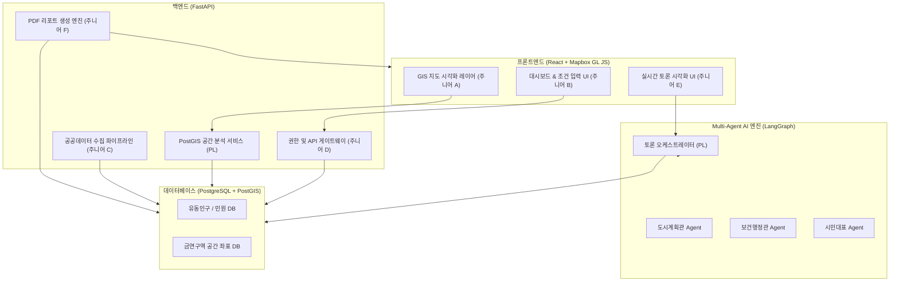
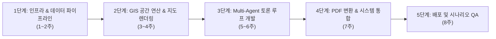

# [프로젝트 구축 및 업무 분배 계획서] 스마트시티 실외 흡연구역 최적 입지 선정 및 검증 플랫폼 (SDSS)

본 계획서는 **미드레벨 1명(PL)과 주니어 개발자 7명**이 AI 코딩 어시스턴트를 활용하여 **8주 내에 본 플랫폼을 실제로 구축하기 위한 구체적인 시스템 설계 자료 및 업무 분배 카드**입니다. 

이 문서는 프로젝트 킥오프(Kick-off) 회의 시 팀원들에게 개별 작업 지시서로 즉시 배포할 수 있도록 실무 수준으로 상세하게 설계되었으며, **학술적·기술적 실증 레퍼런스를 공식 설계 근거로 통합하여 최종 업데이트**되었습니다.

---

## 1. 프로젝트 공식 설계 근거 (Technical & Academic Reference)
본 시스템은 기존 입지 선정 도구들의 최대 한계였던 "부서 간 조율 지연" 및 "주민 간의 공간적 갈등(NIMBY)"을 해결하기 위해 검증된 학술 연구 및 공간 연산 모델을 기반으로 설계되었습니다.

### 📐 GIS 공간 입지 선정 알고리즘 근거
*   **MCLP (Maximal Covering Location Problem) 모델:** 한정된 흡연 부스 예산 내에서 최대 유동인구(수요)를 커버하기 위한 표준 수학적 최적화 배치 알고리즘을 사용합니다.
*   **AHP (Analytic Hierarchy Process) 중첩 분석:** 유동인구 밀집도(40%), 민원 빈도(30%), 기존 금연구역 이격 거리(30%) 등의 공간 가중치 중첩(Overlay) 연산을 수행합니다.
*   *참고 문헌:* 「격자 기반 빅데이터 및 GIS 공간 분석을 활용한 실외 흡연구역 입지 적정성 분석」(한국지역정보화학회) 공간분석 모형 적용.

### 🤖 Multi-Agent 정책 검증 토론 엔진 근거
*   **가상 다자협의체 시뮬레이션:** 입지 선정 이후의 집단 민원 및 행정적 리스크를 예측하기 위해 가상의 에이전트(도시계획관, 보건행정관, 시민대표)를 LangGraph 기반 상태 머신으로 구현하여 상호 의견 조율 프로세스를 자동화합니다.
*   *참고 문헌:* 「Multi-Agent System을 활용한 토지 이용 규제 갈등 조정 시뮬레이션 모델」의 분쟁 조율 시나리오 알고리즘 차용.

---

## 2. 시스템 아키텍처 및 데이터 흐름 (System Architecture)

### 🧱 시스템 컴포넌트 구조

### 🔄 데이터 흐름도 (Data Flow)
1.  **[수집]** ETL 모듈(주니어 C)이 [공공데이터포털](https://www.data.go.kr)의 '전국 금연구역 표준데이터 API' 및 학교/어린이집 위치 정보를 수집해 PostGIS DB에 적재합니다.
2.  **[추천]** 사용자가 웹 UI(주니어 B)에서 동을 지정하면, GIS 엔진(PL)이 금연구역 반경 30m 외곽 및 유동인구 핫스팟 영역을 공간 연산하여 후보지 TOP 3를 지도(주니어 A)에 뿌립니다.
3.  **[토론]** 후보지가 선정되면 LangGraph 엔진(PL)이 구동되어 3명의 가상 에이전트가 토론하고 합의안을 작성하여 WebSocket(주니어 E)을 통해 웹 화면에 실시간 노출합니다.
4.  **[문서]** 합의가 끝나면 PDF 변환기(주니어 F)가 최종 타당성 리포트 문서를 빌드해 관리자에게 다운로드 링크로 제공합니다.

---

## 3. 8주 구축 단계 및 핵심 프로세스

*   **1단계 (1~2주):** Docker Compose 인프라 구성, PostGIS Extension 탑재, 공공 API 적재 모듈 완성.
*   **2단계 (3~4주):** GeoPandas 공간 연산 API 구현 및 Mapbox GL JS 후보지 오버레이 렌더링 연동.
*   **3단계 (5~6주):** LangGraph 기반 [2세트: 3인 페르소나 RAG 토론 심의 위원회] 연동 및 SSE 실시간 스트리밍 구현 및 실시간 WebSocket 채팅 프론트 연동.
*   **4단계 (7주):** HTML/CSS 템플릿 기반 리포트 컴파일러(PDF) 탑재 및 전체 모듈 연계.
*   **5단계 (8주):** 통합 시나리오 테스트 작성 및 시연용 데모 촬영.

---

## 4. 팀원별 상세 업무 분배 카드 (Task Allocation Cards)

> [!NOTE]
> 모든 주니어 팀원은 작업 수행 시 **AI 페어프로그래밍 도구(Cursor, GitHub Copilot 등)**를 적용하여 지시된 템플릿과 라이브러리 가이드를 기준으로 코드를 확장해야 합니다.

### 👤 PL (배종현 - 본인): 아키텍트, GIS PostGIS 공간 분석 & Multi-Agent 핵심 아키텍처 개발
*   **상세 Task:**
    1.  PostgreSQL + PostGIS DB 스키마 및 테이블 정의서 작성.
    2.  `GeoPandas` 및 PostGIS 쿼리를 활용한 실시간 법적 제한 버퍼 존 연산 API(`POST /api/gis/calculate-candidates`) 개발.
    3.  `LangGraph` 기반의 3자 에이전트(도시, 보건, 시민) 토론 엔진 코어 상태 머신 설계.
    4.  주니어들의 Pull Request 코드 리뷰 및 머지(Merge) 권한 관리.
*   **산출물:** GIS 버퍼 연산 API 모듈, LangGraph 상태 머신 백엔드 코드.

---

### 👤 주니어 A (프론트 GIS): Mapbox GL JS 기반 지도 시각화 개발
*   **상세 Task:**
    1.  `Mapbox GL JS` (또는 Leaflet) 라이브러리를 React에 연동하여 기본 지도 화면 렌더링.
    2.  백엔드 GIS API를 호출하여 받아온 GeoJSON 데이터를 기반으로 금연구역 버퍼 레이어와 추천 후보지 TOP 3 핀 마커 시각화.
    3.  지도 클릭 시 좌표 정보를 백엔드로 전달하는 인터랙션 이벤트 바인딩.
*   **산출물:** React Map 컴포넌트 소스코드.

---

### 👤 주니어 B (프론트 UI): 입력 폼 및 대시보드 UI 개발
*   **상세 Task:**
    1.  지자체명(구/동), 희망 반경, 우선순위 가중치(유동인구 우선, 민원 우선 등)를 설정하는 입력 패널 구현.
    2.  선정된 입지의 분석 점수(XAI 그래프) 및 후보지 목록을 카드 형태로 보여주는 대시보드 컴포넌트 개발.
    3.  반응형 CSS 레이아웃 구조 설계 (Tailwind CSS 활용).
*   **산출물:** 입력 제어 폼 및 결과 리포트 대시보드 UI 컴포넌트.

---

### 👤 주니어 C (백엔드 데이터): 공공데이터 ETL 배치 파이프라인 개발
*   **상세 Task:**
    1.  공공데이터포털 오픈 API 및 CSV 파일을 파싱하는 파이썬 크롤러 개발.
    2.  `SQLAlchemy` 또는 `SQLModel`을 사용하여 데이터베이스(PostGIS)에 위경도 포인트(`POINT(x y)`) 객체로 가공해 저장하는 파이프라인 작성.
    3.  매주 일요일 데이터가 업데이트되도록 `APScheduler` 기반 자동 스크립트 작성.
*   **산출물:** 데이터 적재(ETL) 파이썬 스크립트 및 스케줄러 설정 파일.

---

### 👤 주니어 D (백엔드 API): 사용자 인증 및 기본 CRUD 개발
*   **상세 Task:**
    1.  FastAPI 기반의 OAuth2 JWT 사용자 권한/인증(공무원 계정 로그인) 기능 구현.
    2.  지자체별 기존 흡연부스 목록 조회/수정/삭제(CRUD) API 설계.
    3.  민원 접수 데이터를 조회하고 지도 마커용으로 전달하는 API 개발.
*   **산출물:** `Auth Router` 및 `SmokingZone Router` 백엔드 컨트롤러.

---

### 👤 주니어 E (AI 연동): LangGraph 실시간 토론 소켓 통신 구현
*   **상세 Task:**
    1.  LangGraph 에이전트의 토론 상태(`State`) 변화 및 메시지 출력을 실시간으로 프론트엔드로 쏴주기 위한 백엔드 Web Socket 핸들러 구현.
    2.  React 프론트엔드 단에서 웹소켓 스트림을 받아 채팅 말풍선 및 타임라인 애니메이션으로 화면에 순차적으로 렌더링하는 UI 컴포넌트 구현.
*   **산출물:** WebSocket 통신 브릿지 모듈 및 실시간 채팅 컴포넌트.

---

### 👤 주니어 F (리포트 엔진): PDF 자동 생성 모듈 개발
*   **상세 Task:**
    1.  `WeasyPrint` 또는 `PDFKit` 라이브러리를 FastAPI 백엔드에 설치.
    2.  공공 행정 문서(A4 용지 규격, 테이블, 서명란 등) 레이아웃을 가진 HTML/CSS 템플릿 설계.
    3.  입지 선정 가중치 수치와 AI 에이전트 토론 요약본 텍스트를 템플릿에 동적 렌더링하고, PDF 파일로 컴파일하여 내보내는 API(`GET /api/report/download`) 구현.
*   **산출물:** HTML/CSS 보고서 템플릿 및 PDF 컴파일러 모듈.

---

### 👤 주니어 G (인프라 & QA): Docker 배포 및 CI/CD, 통합 테스트 구축
*   **상세 Task:**
    1.  로컬 개발용 및 배포용 `docker-compose.yml` (React + FastAPI + PostGIS) 설계.
    2.  `Pytest` 및 `Playwright`를 이용해 주요 시나리오(로그인 ➔ 동 설정 ➔ 후보지 추천 ➔ 토론 실행 ➔ PDF 다운로드)의 자동화 통합 테스트 스크립트 작성.
    3.  GitHub Actions 연동을 통한 자동 린트(Lint) 및 통합 테스트 실행 CI 스크립트 작성.
*   **산출물:** Dockerfile, Docker Compose 파일 및 테스트 자동화 스크립트.

---

## 5. AI 페어프로그래밍 협업 규칙 (AI Pair Programming Rules)

주니어들이 AI를 사용해 개발할 때 발생할 수 있는 코드 난잡화와 버그 병목을 막기 위해 **PL(나)이 지정한 3대 협업 규칙**입니다.

1.  **AI 컨텍스트 가이드라인 지정:**
    *   주니어들은 코드 생성 프롬프트 작성 시, 반드시 PL이 사전에 정의한 **`DB Schema` 및 `API Specs` 정보**를 컨텍스트로 제공해야 합니다. (엉뚱한 컬럼명이나 API 엔드포인트 생성을 방지)
2.  **AI 코드 맹신 금지 (1차 자가 테스트 필수):**
    *   AI가 짜준 코드는 로컬에서 반드시 유닛 테스트를 작동시켜 성공 여부를 확인한 뒤 Pull Request를 보내야 합니다. 테스트 통과 증빙이 없는 PR은 PL이 반려합니다.
3.  **환각(Error) 발생 시 디버깅 룰:**
    *   동일한 에러가 AI 프롬프트 재시도 3회 이상 발생 시, 자의적인 코드 수정으로 코드를 꼬이게 하지 말고 즉시 PL에게 에러 로그와 함께 공유(코드 리뷰 요청)해야 합니다.
