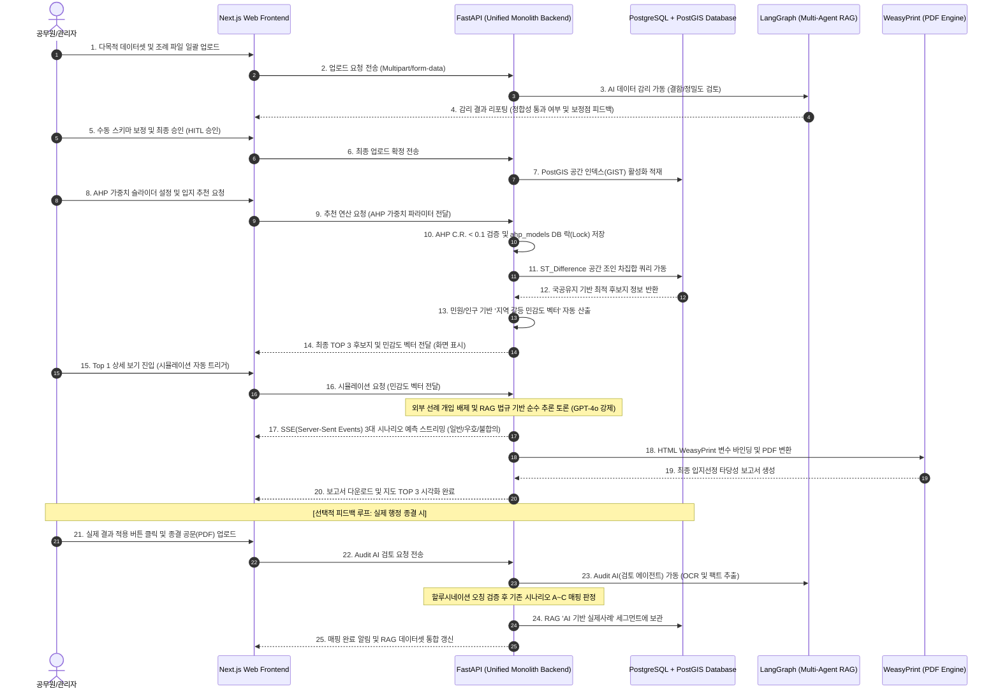

# [기술명세서] 지능형 다목적 스마트시티 입지 선정 및 공공갈등 예측 플랫폼 'OmniSite' 최종 기술 명세서 (v1.0.0-solo-build)

본 기술명세서는 스마트시티 다목적 공간 의사결정 및 공공갈등 예측 플랫폼 **OmniSite(옴니사이트)**의 개발팀원(주니어 A~G)이 참조하여 데이터베이스를 구축하고, 주차별 스프린트를 병렬 완수할 수 있도록 설계된 공식 엔지니어링 명세서입니다.

---

## 1. 📅 1주차~8주차 초정밀 개발 스프린트 계획서 (WBS)

### 1주차: 개발 환경 구축 및 통합 FastAPI 뼈대 셋업
*   **주니어 A (지도):** Mapbox GL JS 로컬 연동 및 Next.js 프레임워크 상의 지적 레이어 오버레이 환경 구성.
*   **주니어 B (UI):** Next.js 기반 다목적 파일 일괄 업로드 폼 및 AI 감리 피드백 팝업창 마크업.
*   **주니어 C (데이터):** 용산구 13종 기초 데이터셋 가독 가공 및 CSV/SHP 분류.
*   **주니어 D (백엔드):** 통합 FastAPI 환경 구축, SQLAlchemy 기반 PostgreSQL/PostGIS DB 연결 및 ORM 모델 기초 작업.
*   **주니어 E (AI):** Python FastAPI 연동, 조례 RAG 임베딩 및 LangGraph 3자 페르소나 독립 토론 루프 초안 설계.
*   **주니어 F (산출물):** WeasyPrint 활용 행정 PDF 보고서 템플릿 마크업 작성.
*   **주니어 G (DevOps):** AWS EKS 클러스터 테넌트 및 VPC 서브넷, IAM 권한(IRSA) 인프라 아키처 수립.

### 2주차: 데이터셋 일괄 업로드 및 AI 감리 (HITL) 완성
*   **주니어 A (지도):** 자치구별 경계 GeoJSON 로드 및 Next.js SSR 환경 상의 격리 레이어 시각화.
*   **주니어 B (UI):** AI 감리 경고 메시지에 따른 사용자 수동 스키마 보정(HITL) 입력 화면 구현.
*   **주니어 C (데이터):** 연속지적도(SHP) 국공유지 PNU 코드 분류 및 GeoPandas 좌표 투영(`EPSG:4326`).
*   **주니어 D (백엔드):** 파일 일괄 업로드 API 구현, FastAPI 내 데이터셋 임시 스토리지 처리 및 DB direct 적재 개발.
*   **주니어 E (AI):** AI 감리 엔진 프롬프트 구현(결함 데이터셋 자동 식별 및 보정 피드백).
*   **주니어 F (산출물):** 데이터 정합성 지수 시각화 차트(Chart.js) 연동.
*   **주니어 G (DevOps):** AWS EKS 상에 통합 FastAPI 및 PostgreSQL/PostGIS 개발용 파드(Pods) 배포.

### 3주차: AHP 가중치 가변 연산 및 최종 부지 도출 (AHP Engine)
*   **주니어 A (지도):** GIS 공간 분석 레이아웃 핀 마커 및 10m/200m 규제 배제 마스크 시각화.
*   **주니어 B (UI):** AHP 가중치 슬라이더 모듈 구현 및 Next.js BFF API 라우트를 통한 가중치 데이터 전송 연동.
*   **주니어 C (데이터):** PostGIS `ST_Buffer` 및 `ST_Difference` 차집합 공간 연산 쿼리 튜닝.
*   **주니어 D (백엔드):** AHP 일관성 비율(C.R. < 0.1) 수학적 검증 로직 및 `ahp_models` DB 저장 락(Lock) 구현.
*   **주니어 E (AI):** 가중치 프로파일별 입지 인자 우선순위 판정 에이전트 연동.
*   **주니어 F (산출물):** WeasyPrint 백엔드 PDF 변환 라우터 및 다운로드 컨트롤러 구현.
*   **주니어 G (DevOps):** PostGIS 차집합 연산 병목 검정 및 공간 인덱스(`GIST`) 최적화.

### 4주차: 지역 갈등 민감도 벡터 연동 및 페르소나 AI 3대 시나리오 예측 모델 통합
*   **주니어 A (지도):** 선정 후보지 TOP 3에 매핑된 실시간 페르소나 토론 말풍선 핀 렌더링.
*   **주니어 B (UI):** 토론 과정을 보여주는 실시간 SSE(Server-Sent Events) 스트리밍 UI 컴포넌트 개발.
*   **주니어 C (데이터):** 후보지 인근 주거 밀도, 민원 핫스팟 및 아동 비율 연계 데이터 보정 수식 검출.
*   **주니어 D (백엔드):** AHP 기반 Top 1~3 부지 디렉토리/탭 구조 데이터 모델 구축. Top 2, 3 부지에 대한 온디맨드 시뮬레이션 트리거 API 설계.
*   **주니어 E (AI):** 민원/인구 기반 **'지역 갈등 민감도 벡터'** 산출 로직 구현. RAG 조례 데이터에 기반한 찬성-반대-정부 페르소나의 독립적 3대 예측 시나리오(일반/우호/불합의) 및 확률 통계(Confidence Score) 연산 프롬프트 완성 (GPT-4o 강제 적용).
*   **주니어 F (산출물):** 3대 시나리오 리포트를 행정 양식 HTML 문서에 동적 바인딩하는 제어기 구현.
*   **주니어 G (DevOps):** AWS EKS Cluster Auto Scaler 연동 및 LangGraph AI 토론 부하 테스트.

### 5주차: 대시보드 리스트 및 Audit AI 자동 검증 파이프라인 구축 (Feedback Loop)
*   **주니어 A (지도):** 사후 결과 매핑이 완료된 부지의 핀 색상을 적격(초록), 불합의(빨강)로 동적 변환 시각화.
*   **주니어 B (UI):** Next.js 대시보드 내 `[의사결정 대기 리스트]` 페이지 및 종결 공문 PDF 드래그앤드롭 업로드 창 개발.
*   **주니어 C (데이터):** RAG 내의 독립적인 `[AI 기반 실제사례]` 저장용 공간 DB 격리 스키마 정의.
*   **주니어 D (백엔드):** Audit AI 검사 라우터 구현 및 실제 결과 대조를 위한 DB CRUD API 작성.
*   **주니어 E (AI):** 업로드된 행정 공문 PDF를 OCR 파싱하여 실제 결과를 자동 팩트체크하고, 기존 시나리오 A~C 매핑 여부를 분류 판정하는 **Audit AI (검토 에이전트)** 파이프라인 개발 (할루시네이션 오분류 100% 필터링).
*   **주니어 F (산출물):** WeasyPrint 보고서 템플릿에 검증 완료 실적 마일스톤 PDF 인쇄 기능 추가.
*   **주니어 G (DevOps):** AWS KMS 및 IAM Role(IRSA) 연동을 통한 공문서 데이터 보안 격리(Multi-Tenancy) 하드닝.

### 6주차~8주차: 통합 연계 테스트, QA, Nginx 배포 및 데모 촬영
*   **주니어 A~G 전원:**
    - 데이터셋 일괄 업로드 ➔ AI 감리 및 HITL ➔ AHP 가중치 잠금 ➔ 최종 부지 도출 ➔ 3대 시나리오 스트리밍 ➔ PDF 다운로드 ➔ 사후 Audit AI 매핑 등록으로 이어지는 E2E 통합 시나리오 테스트.
    - AWS EKS Nginx Ingress Controller 연동 및 HTTPS(SSL) 인증서 발급 보안 하드닝 적용 후 R&D 발표 시연.

---

## 2. 전체 시스템 파이프라인 및 아키텍처 설계도 (System Architecture)

```
[공무원: 데이터셋 일괄 업로드] ➔ [FastAPI Monolith Backend] 
                                          │
                                          ▼ (PostgreSQL/PostGIS 연산)
[공무원: PDF 보고서 다운로드] ⬅ [FastAPI: SSE 실시간 스트리밍] ⬅ [FastAPI: AI 감리 및 HITL 조정]
            ▼ (사후 행정 완료 시)                        │
[공무원: 최종 공문서 PDF 업로드] ➔ [Audit AI: 실증 팩트 검토] ➔ [RAG: 'AI기반 실제사례' 세그먼트 적재]
```



---

## 3. PostgreSQL + PostGIS 물리 DB ERD 명세 (DDL)

모든 공간 지오메트리 정보는 좌표계 **`4326` (WGS84 위경도)**을 기반으로 PostGIS 공간 데이터 객체(`GEOMETRY`)로 가공 저장됩니다.

```sql
-- 1. 자치구역 마스터 테이블
CREATE TABLE districts (
    id SERIAL PRIMARY KEY,
    district_name VARCHAR(100) NOT NULL, -- 예: "서울특별시 용산구"
    sig_cd VARCHAR(5) UNIQUE NOT NULL,    -- 법정 시군구 코드 (예: "11170")
    created_at TIMESTAMP DEFAULT CURRENT_TIMESTAMP
);

-- 2. 서울시 행정구역 (동별) 공간정보 테이블
CREATE TABLE dong_boundaries (
    id SERIAL PRIMARY KEY,
    district_id INT REFERENCES districts(id) ON DELETE CASCADE,
    dong_code VARCHAR(10) UNIQUE NOT NULL, -- 외래키 참조를 위한 UNIQUE 제약 추가
    dong_name VARCHAR(100) NOT NULL,
    geom GEOMETRY(MultiPolygon, 4326) NOT NULL -- 행정동 경계 면 공간 객체
);
CREATE INDEX idx_dong_geom ON dong_boundaries USING GIST(geom);

-- 3. 서울 금연구역 정보 테이블
CREATE TABLE nosmoking_zones (
    id SERIAL PRIMARY KEY,
    district_id INT REFERENCES districts(id) ON DELETE CASCADE,
    dong_id INT REFERENCES dong_boundaries(id) ON DELETE SET NULL, -- 행정동 ID 관계 추가
    zone_name VARCHAR(150),
    address VARCHAR(250),
    geom GEOMETRY(Point, 4326) NOT NULL, -- Point 좌표 객체
    area NUMERIC,
    registered_at DATE
);
CREATE INDEX idx_nosmoking_geom ON nosmoking_zones USING GIST(geom);

-- 4. 서울 어린이집/학교 정보 테이블
CREATE TABLE childcare_centers (
    id SERIAL PRIMARY KEY,
    district_id INT REFERENCES districts(id) ON DELETE CASCADE,
    dong_id INT REFERENCES dong_boundaries(id) ON DELETE SET NULL, -- 행정동 ID 관계 추가
    center_name VARCHAR(150) NOT NULL,
    center_type VARCHAR(50), -- "어린이집", "초등학교", "유치원" 등
    address VARCHAR(250),
    geom GEOMETRY(Point, 4326) NOT NULL,
    student_count INT
);
CREATE INDEX idx_childcare_geom ON childcare_centers USING GIST(geom);

-- 5. 버스/지하철 역사 마스터 위치 테이블
CREATE TABLE transit_stations (
    id SERIAL PRIMARY KEY,
    district_id INT REFERENCES districts(id) ON DELETE CASCADE,
    dong_id INT REFERENCES dong_boundaries(id) ON DELETE SET NULL, -- 행정동 ID 관계 추가
    station_no VARCHAR(50) UNIQUE NOT NULL, -- 이용객 조인을 위한 UNIQUE 제약 추가
    station_name VARCHAR(150) NOT NULL,
    transit_type VARCHAR(10) NOT NULL, -- "BUS" or "SUBWAY"
    geom GEOMETRY(Point, 4326) NOT NULL
);
CREATE INDEX idx_transit_geom ON transit_stations USING GIST(geom);

-- 6. 대중교통 이용객 통계 정보 테이블
CREATE TABLE transit_passengers (
    id SERIAL PRIMARY KEY,
    station_id INT REFERENCES transit_stations(id) ON DELETE CASCADE, -- station_no 직접 참조 대신 ID 외래키 조인으로 개선
    analysis_ym VARCHAR(6) NOT NULL, -- YYYYMM
    boarding_count INT DEFAULT 0,
    alighting_count INT DEFAULT 0,
    total_volume INT DEFAULT 0
);

-- 7. 행정동단위 서울 생활인구 통계 테이블 (Aggregation 요약본)
CREATE TABLE population_stats (
    id SERIAL PRIMARY KEY,
    dong_id INT REFERENCES dong_boundaries(id) ON DELETE CASCADE, -- dong_code 직접 참조 대신 ID 외래키 조인으로 개선
    day_type VARCHAR(10) NOT NULL,  -- "WEEKDAY" or "WEEKEND"
    time_type VARCHAR(10) NOT NULL, -- "RUSH_HOUR", "DAYTIME", "NIGHT"
    avg_population NUMERIC NOT NULL
);

-- 8. 소상공인 상가상권 정보 테이블
CREATE TABLE commercial_shops (
    id SERIAL PRIMARY KEY,
    district_id INT REFERENCES districts(id) ON DELETE CASCADE,
    dong_id INT REFERENCES dong_boundaries(id) ON DELETE SET NULL, -- 행정동 ID 관계 추가
    shop_name VARCHAR(150) NOT NULL,
    category_code VARCHAR(10), -- 업종 코드
    category_name VARCHAR(50),
    geom GEOMETRY(Point, 4326) NOT NULL
);
CREATE INDEX idx_shop_geom ON commercial_shops USING GIST(geom);

-- 9. 자치구 불법흡연 민원 통계 테이블
CREATE TABLE civil_complaints (
    id SERIAL PRIMARY KEY,
    dong_id INT REFERENCES dong_boundaries(id) ON DELETE CASCADE, -- dong_code 직접 참조 대신 ID 외래키 조인으로 개선
    complaint_count INT NOT NULL,
    analysis_year VARCHAR(4) NOT NULL -- YYYY
);

-- 10. 국토교통부 연속지적도 테이블 (사전 슬라이싱 완료본)
CREATE TABLE cadastral_lands (
    id SERIAL PRIMARY KEY,
    district_id INT REFERENCES districts(id) ON DELETE CASCADE,
    dong_id INT REFERENCES dong_boundaries(id) ON DELETE SET NULL, -- 행정동 ID 관계 추가
    pnu VARCHAR(19) NOT NULL,          -- 필지 고유 번호
    jibun VARCHAR(100),
    land_use_code VARCHAR(5),          -- 지목 (도, 공, 체 등)
    ownership_type VARCHAR(10),        -- 소유 구분 (국유지, 시유지 등)
    geom GEOMETRY(MultiPolygon, 4326) NOT NULL -- 다중 폴리곤 통합 처리용 MultiPolygon 변경
);
CREATE INDEX idx_cadastral_geom ON cadastral_lands USING GIST(geom);

-- 11. 전국휴지통데이터 테이블 (가점 요인)
CREATE TABLE trash_bins (
    id SERIAL PRIMARY KEY,
    district_id INT REFERENCES districts(id) ON DELETE CASCADE,
    dong_id INT REFERENCES dong_boundaries(id) ON DELETE SET NULL, -- 행정동 ID 관계 추가
    bin_name VARCHAR(150),
    geom GEOMETRY(Point, 4326) NOT NULL,
    bin_type VARCHAR(50) -- "가로쓰레기통", "담배꽁초수거함" 등
);
CREATE INDEX idx_trash_geom ON trash_bins USING GIST(geom);

-- 12. 주민등록인구 연령별 동별 통계 테이블 (감점 요인)
CREATE TABLE age_demographics (
    id SERIAL PRIMARY KEY,
    dong_id INT REFERENCES dong_boundaries(id) ON DELETE CASCADE, -- dong_code 직접 참조 대신 ID 외래키 조인으로 개선
    youth_population INT NOT NULL,     -- 만 19세 미만 인구
    total_population INT NOT NULL,     -- 행정동 총인구
    youth_ratio NUMERIC NOT NULL       -- youth_population / total_population
);

-- 13. 담배꽁초상습무단투기지역현황 테이블 (최상위 가중치)
CREATE TABLE cigarette_dumping_zones (
    id SERIAL PRIMARY KEY,
    district_id INT REFERENCES districts(id) ON DELETE CASCADE,
    dong_id INT REFERENCES dong_boundaries(id) ON DELETE SET NULL, -- 행정동 ID 관계 추가
    address VARCHAR(250),
    detail_location TEXT,
    geom GEOMETRY(Point, 4326) NOT NULL
);
CREATE INDEX idx_dumping_geom ON cigarette_dumping_zones USING GIST(geom);

-- 14. AHP 가중치 프로파일 마스터 테이블 (추가)
CREATE TABLE ahp_models (
    id SERIAL PRIMARY KEY,
    district_id INT REFERENCES districts(id) ON DELETE CASCADE,
    facility_type VARCHAR(50) NOT NULL DEFAULT 'smoking_zone', -- 입지 분석 대상 인프라 종류
    criteria_weights JSONB NOT NULL, -- 인자별 설정 가중치 매트릭스 백업
    consistency_ratio NUMERIC NOT NULL, -- 일관성 비율 (C.R. < 0.1 검증값)
    is_locked BOOLEAN DEFAULT FALSE, -- 의사결정 시 조작 방지 락 상태
    created_at TIMESTAMP DEFAULT CURRENT_TIMESTAMP
);

-- 15. 시뮬레이션 결과 리포트 캐시 테이블 (추가)
CREATE TABLE conflict_simulations (
    id SERIAL PRIMARY KEY,
    cadastral_land_id INT REFERENCES cadastral_lands(id) ON DELETE CASCADE, -- 지적 필지 FK
    facility_type VARCHAR(50) NOT NULL DEFAULT 'smoking_zone', -- 시뮬레이션 대상 인프라 종류
    css_score NUMERIC NOT NULL, -- 종합 갈등 민감도 점수 (CSS)
    css_vector JSONB NOT NULL, -- 3대 민감도 인자 벡터 백업
    normal_scenario TEXT, -- 일반 시나리오 토론 로그
    optimal_scenario TEXT, -- 우호적 타결 시나리오 토론 로그
    worst_scenario TEXT, -- 극단적 불합의 시나리오 토론 로그
    confidence_score NUMERIC, -- 시뮬레이션 통계적 신뢰도 점수
    created_at TIMESTAMP DEFAULT CURRENT_TIMESTAMP
);

-- 16. Audit AI 공문서 검증을 필터링 통과한 실제 이행 사례 기록 테이블 (추가)
CREATE TABLE verified_precedents (
    id SERIAL PRIMARY KEY,
    conflict_simulation_id INT REFERENCES conflict_simulations(id) ON DELETE SET NULL, -- 이전 가상 시뮬레이션 매핑 FK
    document_title VARCHAR(250), -- 행정 공문서 타이틀
    document_ocr_text TEXT, -- OCR로 정제 추출된 실제 결과 텍스트
    actual_scenario VARCHAR(50) NOT NULL, -- 실제 매핑된 시나리오 유형 ('NORMAL', 'OPTIMAL', 'WORST')
    verified_at TIMESTAMP DEFAULT CURRENT_TIMESTAMP
);

-- 17. 자치구별 조례 RAG 임베딩 테이블 (추가)
CREATE TABLE district_regulations (
    id SERIAL PRIMARY KEY,
    district_id INT REFERENCES districts(id) ON DELETE CASCADE, -- 관할지 ID (NULL일 경우 대한민국 공통 법령)
    regulation_title VARCHAR(250) NOT NULL,                    -- 조례명
    clause_number VARCHAR(50),                                  -- 조항 번호
    content TEXT NOT NULL,                                      -- 조례 본문 청크
    embedding VECTOR(1536) NOT NULL,                            -- OpenAI 임베딩 벡터
    category VARCHAR(50) NOT NULL DEFAULT 'health_sanitation',   -- 조례 카테고리
    created_at TIMESTAMP DEFAULT CURRENT_TIMESTAMP
);
CREATE INDEX idx_regulations_district_category_vector ON district_regulations (district_id, category) INCLUDE (embedding);

-- 18. 범용 스마트시티 공간 시설물 테이블 (가/감점 요인 통합 관리용) (추가)
CREATE TABLE city_spatial_features (
    id SERIAL PRIMARY KEY,
    district_id INT REFERENCES districts(id) ON DELETE CASCADE,
    dong_id INT REFERENCES dong_boundaries(id) ON DELETE SET NULL,
    feature_type VARCHAR(50) NOT NULL, -- 'cctv', 'ev_charger', 'streetlight', 'trash_bin' 등
    feature_name VARCHAR(150),
    geom GEOMETRY(Point, 4326) NOT NULL,
    properties JSONB,                  -- 개별 시설물별 특수 데이터 유연 적재
    created_at TIMESTAMP DEFAULT CURRENT_TIMESTAMP
);
CREATE INDEX idx_city_features_geom ON city_spatial_features USING GIST(geom);
CREATE INDEX idx_city_features_type ON city_spatial_features (feature_type);
```
```

---

## 4. 🗄️ PostGIS & pgvector 통합 하이브리드 데이터베이스 아키텍처

물리적 보안성, 기하적 무결성, 그리고 자연어 행정 조례 추론을 조화시키기 위해, 플랫폼은 RDB 데이터베이스(PostgreSQL) 내에 **PostGIS(공간 연산)**와 **pgvector(임베딩 벡터 연산)** 확장 기능을 동시에 탑재하는 **단일 통합 데이터베이스 아키텍처**를 채택합니다. 이로써 트랜잭션의 ACID 일관성을 백퍼센트 보장하고 조인 연산을 최적화합니다.

### 4.1. 기하 좌표계 연산 엔진 (PostGIS)
*   **역할:** 100% 정밀도가 요구되는 법정 규제 버퍼 필터링 및 차집합 필지 도출.
*   **대상 데이터:** 지적도 필지 폴리곤, 학교 정화구역(200m), 지하철역(10m), 군사보호구역(400m) 등의 물리적 지오메트리 정보.
*   **동작 매커니즘:** 사용자가 Step 2에서 핀을 조작하거나 AHP 가중치를 잠글 때, FastAPI 백엔드는 `ST_Contains`, `ST_Difference`, `ST_Buffer` 등의 기하 쿼리를 통해 물리적인 공간 교차 여부를 정확한 메트릭스 수치로 반환합니다.

### 4.2. 행정 조례/사례 추론 엔진 (pgvector RAG)
*   **역할:** 지오메트리 상에서 규제 구역 교차(Intersects) 판정 시, 해당 자치구의 행정 조례 및 가중 조항 문서를 탐색하여 LLM 시뮬레이션 토론에 RAG로 공급.
*   **대상 데이터:** 국방부 군사기지법 조례 전문 PDF, 각 자치구별 도시계획조례안 HWP/PDF, 실제 준공 공문서 요약본.
*   **동작 매커니즘 (관할지 코드 선제 필터링 - Pre-filtering):** 
    1.  PostGIS가 특정 필지에 대해 "군사보호구역 침범" 또는 "공공용지 조례 해당" 판정을 반환합니다.
    2.  FastAPI 백엔드는 담당 공무원 계정의 관할지 코드(`district_id`)를 획득하여 `district_regulations` 테이블에 B-Tree 인덱스 필터링 조건을 선제 적용합니다.
    3.  필터링된 자치구 법령 범위 내에서만 `pgvector` 코사인 유사도 검색(ANN)을 제한 수행하여 RAM 점유율을 줄이고 레이턴시를 1ms 이하로 단축합니다.
    4.  검색된 규제 세부 조항 텍스트를 프롬프트의 컨텍스트(Context)로 묶어 Step 5의 LangGraph LLM 심의 에이전트 그룹에 주입하여 객관적 모의 심의 토론을 생성합니다.

---

## 5. ⚡ 대용량 공간 데이터 렌더링 최적화 설계 방안 (Rendering Optimization)

수만 건의 필지 폴리곤 및 전국 단위 규제 구역 데이터를 브라우저 단에서 렉(Lag) 없이 부드럽게 시각화하기 위해 아래와 같은 3단계 최적화 아키텍처를 적용합니다.

### 5.1. 클라이언트 렌더러 전환: SVG ➔ Canvas Renderer
*   **기본 구조의 한계:** Leaflet의 기본 렌더러는 폴리곤 하나당 하나의 DOM(SVG) 엘리먼트를 생성하므로, 1,000개 이상의 필지를 로드하면 DOM 트리 비대로 인해 프레임 저하가 발생합니다.
*   **최적화 적용:** Leaflet 맵 인스턴스 초기화 시 `renderer: L.canvas()` 옵션을 강제 지정합니다. 모든 벡터 도형(지적선, 버퍼 서클)이 단일 HTML5 Canvas 엘리먼트 내에 드로잉되므로 **10,000개 이상의 공간 객체를 60fps로 실시간 렌더링**할 수 있습니다.

### 5.2. 공간 쿼리 최적화: Bounding Box 동적 필터링
*   **백엔드 부하 차단:** 용산구 전체 또는 서울시 전체 지적 데이터를 한 번에 로드하지 않고, 사용자의 현재 지도 화면 영역(Viewport)에 해당하는 부분만 동적으로 쿼리합니다.
*   **동작 매커니즘:** 
    1.  지도의 `moveend` 또는 `zoomend` 이벤트 발생 시, 현재 브라우저 화면의 남서/북동 좌표(Bounds)를 획득합니다.
    2.  FastAPI 백엔드에 `ST_MakeEnvelope(xmin, ymin, xmax, ymax, 4326)` 쿼리를 날려 **화면 영역 안에 포함된 필지만 제한하여 페이징 호출**합니다.
    3.  지적도 테이블(`cadastral_lands`)의 `geom` 컬럼에 공간 인덱스(`GIST`)를 활성화하여 바운딩 박스 검색 속도를 10ms 이하로 단축합니다.

### 5.3. React 컴포넌트 렌더 락 (Render Lock) 및 메모이제이션
*   **리렌더링 제거:** AHP 슬라이더를 드래그할 때 가중치 상태(`ahpWeights`)가 실시간 변경되는데, 이때마다 무거운 지도 컴포넌트 전체가 다시 그리는(Re-mount) 현상을 방지합니다.
*   **최적화 적용:** 
    *   지도 영역을 독립된 자식 컴포넌트(`InteractiveMap.js`)로 완전 분리하고, **`React.memo`**로 랩핑하여 부모 컴포넌트의 슬라이더 값 변화가 지도의 재초기화를 유발하지 않도록 통제합니다.
    *   Next.js에서 SSR(서버 사이드 렌더링) 시 `window` 객체 부재로 인한 맵 빌드 크래시를 방지하기 위해, `next/dynamic` 모듈을 이용하여 **`ssr: false` 옵션으로 지도를 Lazy-loading 로드**합니다.

---

## 6. 🔌 REST API 명세 (RAG 및 조례 관리 엔드포인트)

| Method | Endpoint | Description | Request Body / Params | Response Schema (200 OK) |
| :---: | :--- | :--- | :--- | :--- |
| **GET** | `/api/v1/upload/regulations` | 등록된 조례/시행규칙 목록 비동기 조회 | 없음 | `{"regulations": [{"filename": "string", "size_bytes": 0}]}` |
| **POST** | `/api/v1/upload/regulation` | 조례 PDF 다중 등록 및 텍스트 캐싱 (중복 차단 적용) | `files: Multipart/form-data` | `{"message": "string", "files": [...]}` (중복 시 `400 Bad Request` 에러) |
| **DELETE** | `/api/v1/upload/regulations/{filename}` | 조례 물리 파일 및 추출된 텍스트 캐시(.txt) 동시 삭제 | `filename` (Path Variable) | `{"message": "성공적으로 [filename] 및 연관 캐시를 삭제했습니다."}` |


