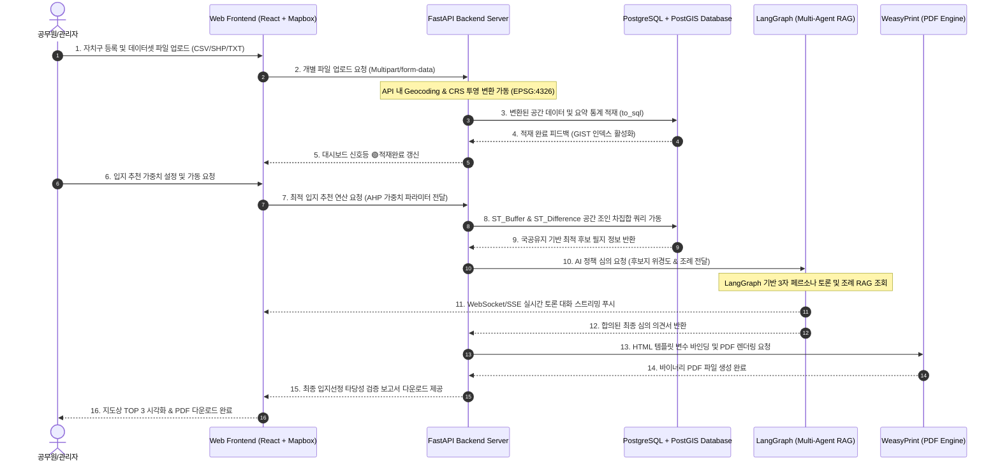

# [기술명세서] 스마트시티 SDSS 플랫폼 최종 기술 명세서 (WBS, 아키텍처, ERD)

본 기술명세서는 스마트시티 실외 흡연구역 최적 입지 선정 및 검증 플랫폼(SDSS) 개발팀원(주니어 A~G)이 참조하여 데이터베이스를 구축하고, 주차별 스프린트를 병렬 완수할 수 있도록 설계된 공식 엔지니어링 명세서입니다.

---

## 1. 📅 1주차~8주차 초정밀 개발 스프린트 계획서 (WBS)

### 1주차: 개발 환경 구축 및 기초 데이터 수집
*   **주니어 A (지도):** Mapbox GL JS 로컬 연동 환경 설정 및 Mapbox Access Token 발급.
*   **주니어 B (UI):** Admin 대시보드(상태 표시등 탑재) 및 파일 업로드 폼 마크업 퍼블리싱.
*   **주니어 C (데이터):** 용산구 13대 데이터셋 원천 파일(CSV/SHP/TXT) 수집 및 가공 가이드 준수 검토.
*   **주니어 D (백엔드):** PostgreSQL/PostGIS DB 테이블 DDL 정의 및 FastAPI 기본 뼈대 코드 구축.
*   **주니어 E (AI):** LangGraph 라이브러리 세팅 및 자치구 조례 기반 단순 RAG 파이프라인 설계.
*   **주니어 F (산출물):** 타당성 검증 최종 보고서 표준 양식 HTML/CSS 레이아웃 프로토타입 마크업.
*   **주니어 G (DevOps):** FastAPI, PostGIS, React를 원클릭 가동할 `docker-compose.yml` 작성 및 배포.

### 2주차: 데이터 적재 (ETL) 파이프라인 완성
*   **주니어 A (지도):** 서울시 동별 공간경계 GeoJSON 데이터를 받아 지도 레이어 상에 오버레이 성공.
*   **주니어 B (UI):** 13대 데이터셋 항목별 개별 파일 업로드 UI 컴포넌트 이벤트 핸들러 구현.
*   **주니어 C (데이터):** GeoPandas를 활용하여 연속지적도(SHP) 국공유지 필지만 슬라이싱 처리하고 CRS를 `EPSG:4326`으로 변환하는 전처리 코드 개발.
*   **주니어 D (백엔드):** FastAPI 파일 업로드 엔드포인트 구현 및 Pandas `to_sql` 연동 적재 완료.
*   **주니어 E (AI):** LangGraph 멀티 에이전트(3인 페르소나) 간의 대화 상태 머신 제어 로직 설계.
*   **주니어 F (산출물):** HTML 보고서 상에 XAI 정량 지표용 차트(Chart.js) 렌더링 스크립트 연동.
*   **주니어 G (DevOps):** 주니어 C의 파이썬 정제 스크립트 실행 환경 통합 및 DB 마이그레이션 도구 연동.

### 3주차: GIS 공간 분석 엔진 (Spatial Engine) 구축
*   **주니어 A (지도):** 지도에서 마우스 클릭 시 해당 지점의 위경도 좌표를 추출하여 API로 던지는 핀 마커 모듈 구현.
*   **주니어 B (UI):** AHP 가중치 가변 슬라이더 폼 UI 개발 및 입력값 REST API 전송 모듈 구현.
*   **주니어 C (데이터):** PostGIS의 `ST_Buffer` 및 `ST_Difference`를 가동하여 금연구역 배제 버퍼 폴리곤 자동화 SQL 쿼리 작성.
*   **주니어 D (백엔드):** 지적도 국공유지 필지와 금연구역 버퍼를 비교 차집합 연산하여 실시간으로 설치 가능 폴리곤 영역을 반환하는 GIS 공간 연산 API 완성.
*   **주니어 E (AI):** 조례 RAG의 다중 자치구 분기 로직(선택한 자치구 조례 폴더 매핑) 구현.
*   **주니어 F (산출물):** WeasyPrint 파이썬 PDF 변환 모듈을 FastAPI 서버와 연동하여 HTML을 PDF 파일로 렌더링하는 API 구축.
*   **주니어 G (DevOps):** PostGIS 공간 쿼리 병목 지점 체크 및 DB 인덱스(`GIST`) 튜닝 QA.

### 4주차: 입지 추천 알고리즘 (AHP/MCLP) 튜닝
*   **주니어 A (지도):** 백엔드에서 반환된 최적 후보지 TOP 3 공간 좌표(Polygon 및 Point)를 지도 위에 렌더링.
*   **주니어 B (UI):** 추천 완료 후, 최종 점수 산출 가중치(유동인구, 민원, 안전성)를 시각화할 XAI 차트 모달창 연동.
*   **주니어 C (데이터):** 버스/지하철 노드 유동인구 통계와 상가 밀집도, 담배꽁초 무단투기 데이터를 중첩 연산하는 가중치 산출 수식 보정.
*   **주니어 D (백엔드):** 사용자가 웹에서 보낸 가중치 슬라이더 변수값에 따라 실시간으로 AHP 점수를 재계산해 주는 최적 입지 추천 API 완성.
*   **주니어 E (AI):** 3인 에이전트가 찬반 토론을 마친 뒤, 합의된 최종 정책 제언 텍스트를 출력하는 LangGraph 루프 완성.
*   **주니어 F (산출물):** 최종 추천 결과 및 AI 토론 텍스트를 HTML 보고서 템플릿의 변수에 동적으로 바인딩하는 진화 코드 완성.
*   **주니어 G (DevOps):** 1단계~4단계 백엔드 API 통합 성능 테스트 및 병목 지점 QA.

### 5주차: LangGraph Multi-Agent 시뮬레이션 고도화
*   **주니어 A (지도):** 가상의 에이전트들이 실시간으로 의견을 주고받는 말풍선 UI를 지도 후보지 핀 옆에 팝업 형태로 시각화.
*   **주니어 B (UI):** 실시간 대화 스트리밍창 퍼블리싱 및 WebSocket/SSE 데이터 수신 인터페이스 연동.
*   **주니어 C (데이터):** 자치구별 민원 통계와 꽁초 상습 투기 지점에 대한 거리 가중치 데이터 연계 보정.
*   **주니어 D (백엔드):** LangGraph 에이전트 토론 과정을 프론트엔드로 실시간 푸시하는 SSE(Server-Sent Events) API 구축.
*   **주니어 E (AI):** 에이전트별 찬반 태도 가이드라인(보건관: 규제 엄격, 상인대표: 편의성 중시 등) 프롬프트 고도화 및 GPT-4o-mini 성능 최적화.
*   **주니어 F (산출물):** PDF 변환 시 한글 폰트 깨짐 방지를 위한 Noto Sans CJK 웹폰트 정적 파일 연동 및 CSS 인쇄 매체 속성 조율.
*   **주니어 G (DevOps):** OpenAI API 호출 실패 시 재시도(Retry) 및 Fallback 예외 처리 아키텍처 검증.

### 6주차: 컴포넌트 통합 및 연계 테스트
*   **주니어 A/B (프론트):** 지도 핀 마커 클릭 ➔ 후보지 상세 정보 ➔ AI 토론 모달 ➔ PDF 보고서 출력으로 이어지는 전체 UI 흐름 매끄럽게 연결.
*   **주니어 C/D (데이터/백엔드):** 다중 자치구(용산, 노원 등) 신규 등록 시, 자치구 ID 격리 데이터 주입 및 독립 분석 작동 여부 최종 확인.
*   **주니어 E/F (AI/보고서):** 조례 RAG 기반 AI 심의 의견 전문이 PDF 보고서 상에 단락 깨짐 없이 미려하게 인쇄되는지 렌더링 정밀 튜닝.
*   **주니어 G (DevOps):** 통합 환경에서의 엔드투엔드(E2E) 자동화 통합 테스트 시나리오 작성 및 QA.

### 7주차: 실운영 배포 및 QA 디버깅
*   **주니어 A~G 전원:**
    - 통합 시나리오 테스트(로그인 ➔ 신규 자치구 등록 ➔ 파일 10종 업로드 ➔ 용산구 아현동/한강로동 입지 연산 ➔ 찬반 토론 ➔ PDF 보고서 출력) QA 가동.
    - 주니어 G의 주도 하에 Docker Compose 프로덕션 환경용 리버스 프록시(Nginx) 세팅 및 컨테이너 보안 하드닝 적용.
    - 발견된 에이전트 환각 현상(Hallucination) 및 GIS 연산 오차 디버깅.

### 8주차: 데모 촬영 및 프로젝트 최종 완료
*   **주니어 A~G 전원:**
    - AWS 또는 지자체 실서버 임시 인프라 가동 데모 서버 배포 완료.
    - 실제 구동 과정을 담은 시연 비디오 촬영 및 마일스톤 산출물 최종 서명.
    - 최종 R&D 발표 자료 작성 및 발표 예행연습.

---

## 2. 전체 시스템 파이프라인 및 아키텍처 설계도 (System Architecture)



---

## 3. PostgreSQL + PostGIS 물리 DB ERD 명세 (DDL)

모든 공간 지오메트리 정보는 좌표계 **`4326` (WGS84 위경도)**을 기반으로 PostGIS 공간 데이터 객체(`GEOMETRY`)로 가공 저장됩니다.

```sql
-- 1. 자치구역 마스터 테이블
CREATE TABLE districts (
    id SERIAL PRIMARY KEY,
    district_name VARCHAR(100) NOT NULL, -- 예: "서울특별시 용산구"
    sig_cd VARCHAR(5) UNIQUE NOT NULL,    -- 법정 시군구 코드 (예: "11170")
    created_at TIMESTAMP DEFAULT CURRENT_TIMESTAMP
);

-- 2. 서울 금연구역 정보 테이블
CREATE TABLE nosmoking_zones (
    id SERIAL PRIMARY KEY,
    district_id INT REFERENCES districts(id) ON DELETE CASCADE,
    zone_name VARCHAR(150),
    address VARCHAR(250),
    geom GEOMETRY(Point, 4326) NOT NULL, -- Point 좌표 객체
    area NUMERIC,
    registered_at DATE
);
CREATE INDEX idx_nosmoking_geom ON nosmoking_zones USING GIST(geom);

-- 3. 서울 어린이집/학교 정보 테이블
CREATE TABLE childcare_centers (
    id SERIAL PRIMARY KEY,
    district_id INT REFERENCES districts(id) ON DELETE CASCADE,
    center_name VARCHAR(150) NOT NULL,
    center_type VARCHAR(50), -- "어린이집", "초등학교", "유치원" 등
    address VARCHAR(250),
    geom GEOMETRY(Point, 4326) NOT NULL,
    student_count INT
);
CREATE INDEX idx_childcare_geom ON childcare_centers USING GIST(geom);

-- 4. 버스/지하철 역사 마스터 위치 테이블
CREATE TABLE transit_stations (
    id SERIAL PRIMARY KEY,
    district_id INT REFERENCES districts(id) ON DELETE CASCADE,
    station_no VARCHAR(50) NOT NULL, -- 버스 정류소 번호 또는 역사 ID
    station_name VARCHAR(150) NOT NULL,
    transit_type VARCHAR(10) NOT NULL, -- "BUS" or "SUBWAY"
    geom GEOMETRY(Point, 4326) NOT NULL
);
CREATE INDEX idx_transit_geom ON transit_stations USING GIST(geom);

-- 5. 대중교통 이용객 통계 정보 테이블
CREATE TABLE transit_passengers (
    id SERIAL PRIMARY KEY,
    station_no VARCHAR(50) NOT NULL,
    analysis_ym VARCHAR(6) NOT NULL, -- YYYYMM
    boarding_count INT DEFAULT 0,
    alighting_count INT DEFAULT 0,
    total_volume INT DEFAULT 0
);
CREATE INDEX idx_passenger_station ON transit_passengers(station_no);

-- 6. 행정동단위 서울 생활인구 통계 테이블 (Aggregation 요약본)
CREATE TABLE population_stats (
    id SERIAL PRIMARY KEY,
    dong_code VARCHAR(10) NOT NULL, -- 행정동 코드
    day_type VARCHAR(10) NOT NULL,  -- "WEEKDAY" or "WEEKEND"
    time_type VARCHAR(10) NOT NULL, -- "RUSH_HOUR", "DAYTIME", "NIGHT"
    avg_population NUMERIC NOT NULL
);
CREATE INDEX idx_pop_dong ON population_stats(dong_code);

-- 7. 서울시 행정구역 (동별) 공간정보 테이블
CREATE TABLE dong_boundaries (
    id SERIAL PRIMARY KEY,
    district_id INT REFERENCES districts(id) ON DELETE CASCADE,
    dong_code VARCHAR(10) NOT NULL,
    dong_name VARCHAR(100) NOT NULL,
    geom GEOMETRY(MultiPolygon, 4326) NOT NULL -- 행정동 경계 면 공간 객체
);
CREATE INDEX idx_dong_geom ON dong_boundaries USING GIST(geom);

-- 8. 소상공인 상가상권 정보 테이블
CREATE TABLE commercial_shops (
    id SERIAL PRIMARY KEY,
    district_id INT REFERENCES districts(id) ON DELETE CASCADE,
    shop_name VARCHAR(150) NOT NULL,
    category_code VARCHAR(10), -- 업종 코드
    category_name VARCHAR(50),
    geom GEOMETRY(Point, 4326) NOT NULL
);
CREATE INDEX idx_shop_geom ON commercial_shops USING GIST(geom);

-- 9. 자치구 불법흡연 민원 통계 테이블
CREATE TABLE civil_complaints (
    id SERIAL PRIMARY KEY,
    dong_code VARCHAR(10) NOT NULL,
    complaint_count INT NOT NULL,
    analysis_year VARCHAR(4) NOT NULL -- YYYY
);

-- 10. 국토교통부 연속지적도 테이블 (사전 슬라이싱 완료본)
CREATE TABLE cadastral_lands (
    id SERIAL PRIMARY KEY,
    district_id INT REFERENCES districts(id) ON DELETE CASCADE,
    pnu VARCHAR(19) NOT NULL,          -- 필지 고유 번호
    jibun VARCHAR(100),
    land_use_code VARCHAR(5),          -- 지목 (도, 공, 체 등)
    ownership_type VARCHAR(10),        -- 소유 구분 (국유지, 시유지 등)
    geom GEOMETRY(Polygon, 4326) NOT NULL
);
CREATE INDEX idx_cadastral_geom ON cadastral_lands USING GIST(geom);

-- 11. 전국휴지통데이터 테이블 (가점 요인)
CREATE TABLE trash_bins (
    id SERIAL PRIMARY KEY,
    district_id INT REFERENCES districts(id) ON DELETE CASCADE,
    bin_name VARCHAR(150),
    geom GEOMETRY(Point, 4326) NOT NULL,
    bin_type VARCHAR(50) -- "가로쓰레기통", "담배꽁초수거함" 등
);
CREATE INDEX idx_trash_geom ON trash_bins USING GIST(geom);

-- 12. 주민등록인구 연령별 동별 통계 테이블 (감점 요인)
CREATE TABLE age_demographics (
    id SERIAL PRIMARY KEY,
    dong_code VARCHAR(10) NOT NULL,
    youth_population INT NOT NULL,     -- 만 19세 미만 인구
    total_population INT NOT NULL,     -- 행정동 총인구
    youth_ratio NUMERIC NOT NULL       -- youth_population / total_population
);

-- 13. 담배꽁초상습무단투기지역현황 테이블 (최상위 가중치)
CREATE TABLE cigarette_dumping_zones (
    id SERIAL PRIMARY KEY,
    district_id INT REFERENCES districts(id) ON DELETE CASCADE,
    address VARCHAR(250),
    detail_location TEXT,
    geom GEOMETRY(Point, 4326) NOT NULL
);
CREATE INDEX idx_dumping_geom ON cigarette_dumping_zones USING GIST(geom);
