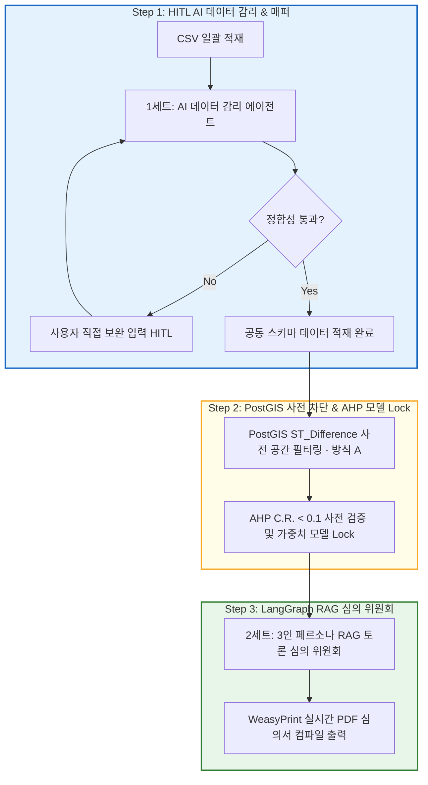

# [사업계획서] 다목적 스마트시티 공간 의사결정시스템(SDSS) 최종 사업계획서
- **프로젝트 브랜드명:** OmniSite (옴니사이트) 또는 UrbanScope (어반스코프)
- **시범 실증 모델(PoC):** 용산구 스마트 실외 흡연구역 최적 입지 선정 및 조례 검증

---

## 1. 프로젝트 개요 (Executive Summary)
본 프로젝트는 특정 단일 목적 시설물에 국한되지 않고, 지자체의 다양한 공공 인프라(스마트 흡연부스, 어린이 옐로카펫, 실버 스마트 쉼터 등)의 최적 입지를 선정하고 관련 법정 규제를 검증하는 **다목적 공간 의사결정 범용 플랫폼(OmniSite)**을 구축하는 것을 목적으로 합니다. 

1차 시범 모델(PoC)로서 간접흡연 분쟁이 극심한 용산구 관내의 실외 흡연구역 입지 선정을 실증하며, 이를 위해 **1) HITL(Human-In-The-Loop) AI 데이터 감리 에이전트, 2) PostGIS 기반 ST_Difference 사전 규제 배제 필터링, 3) 일관성 비율(C.R. < 0.1) 검증 기반 AHP 모델 Lock 시스템, 4) LangGraph Multi-Agent RAG 심의 위원회**를 통합하는 3단계 지능형 행정 파이프라인을 구현합니다.

---

## 2. 정리데이터 기반의 수집 및 정제 데이터셋 명세 (Physical Dataset Specification)
플랫폼의 시범 검증에 활용되는 데이터셋은 데스크톱 `0.1\정리데이터` 에 적재 완료된 **실물 공공데이터 19종**이며, 스키마 및 레코드 통계 정합성을 100% 무결하게 일치시켰습니다.

| 연번 | 물리 데이터셋 파일명 | 데이터 유형 (Format) | 레코드 수 (Rows) | 주요 공간/정량 속성 컬럼 (Schema Map) |
| :--- | :--- | :---: | :---: | :--- |
| 1 | `LSMD_CONT_LDREG_YONGSAN_FILTERED_연속지적도.csv` | CSV (Point/Poly) | 6,292 | `PNU`, `지번주소`, `지목코드` (도로/주차장/공원 추출용) |
| 2 | `(핵심타겟)용산구 불법흡연 민원 데이터_E1.csv` | CSV (Address/Point) | - | `민원지번주소`, `민원좌표`, `발생시간` (AHP 5점 보정 및 실증 그라운드 트루스 활용) |
| 3 | `서울시 버스정류소 위치정보_YONGSAN.csv` | CSV (Point) | 338 | `정류소 ID`, `정류소명`, `X좌표(경도)`, `Y좌표(위도)` (10m 금역 차단) |
| 4 | `서울시 어린이집 정보_YONGSAN.csv` | CSV (Point) | 179 | `어린이집명`, `상세주소`, `시설 위도`, `시설 경도` (30m 안전 차단) |
| 5 | `서울시 용산구 학교 기본정보_YONGSAN.csv` | CSV (Address) | 132 | `학교명`, `도로명주소`, `학교종류명` (스쿨존 200m 안전 차단) |
| 6 | `서울시_지하철역_연계_지하도_공간정보_YONGSAN.csv` | CSV (WKT Line) | 226 | `지하도WKT` (ST_Start/EndPoint 지하철역 10m 금역 차단 복원용) |
| 7 | `소상공인시장진흥공단_상가_YONGSAN.csv` | CSV (Point) | 15,726 | `상호명`, `상권업종소분류명`, `경도`, `위도` (6대 흡연 상권 지수화) |
| 8 | `서울특별시 용산구_흡연구역_20240719 (1).csv` | CSV (Point) | 76 | `설치위치`, `위도`, `경도` (기존 구역 50m 중복 배제 연동) |
| 9 | `용산구_실외_금연구역_지정현황_근거용데이터.csv` | CSV (Text) | 23 | `금연구역종류`, `지정구역`, `이격거리규정` (조례 대조용 메타) |
| 10 | `용산구_법정동_행정동_연계매핑.csv` | CSV (Code Match) | 39 | `행정동코드`, `행정동명`, `법정동코드`, `법정동명` (생활인구 조인) |
| 11 | `sig.shp` / `sig.dbf` | SHP (Vector) | 1 | 관할 시군구(용산구) 행정 경계 폴리곤 |
| 12 | `emd.shp` / `emd.dbf` | SHP (Vector) | 1 | 관할 법정 읍면동 행정 경계 폴리곤 |
| 13 | `서울특별시 금연환경 조성 조례 시행규칙.hwp` | HWP (Text) | - | 용산구 금연 환경 조성 조례 및 시행규칙 전문 (RAG 지식원천) |

---

## 3. 다목적 공간-AI 3단계 의사결정 아키텍처 (3-Step Pipeline)

본 플랫폼은 데이터의 시맨틱 감리부터 법적 차단, 알고리즘 연산, 최종 RAG 토론까지 이어지는 **3단계 하이브리드 아키텍처**를 채택하여 구현의 무결성을 확보합니다.

### 1단계: HITL AI 데이터 감리 및 스키마 매퍼 (Data Auditing)
*   **[1세트: AI 데이터 감리 에이전트]**가 업로드된 CSV의 첫 5행 스니펫을 읽어 목적(PoC: 흡연부스)에 부합하는지 시맨틱 분석을 실행합니다.
*   공간 정보(주소/위경도)나 정량 지수 컬럼을 자동 추천하며, 정합성 위배 시 상세 사유를 사용자에게 피드백합니다.
*   사용자는 **HITL(Human-In-The-Loop) 피드백 루프**를 통해 추가 지시(직접 입력)를 주어 업로드 매핑을 복구·완수합니다.

### 2단계: PostGIS ST_Difference 사전 필터링 및 AHP 모델 Lock (GIS & AHP Engine)
*   **공간 필터 사전 배제(방식 A):** 가점 연산 시작 전, PostGIS 단에서 10m 금연구역(지하철/버스) 및 200m 통학 절대보호구역 버퍼의 차집합 연산(`ST_Difference`)을 실행하여 불법 위법 필지를 기하학적으로 도려내고 100% 합법적 국공유지 필지만 AHP 연산으로 넘겨 행정 사고를 차단합니다.
*   **AHP 모델 Lock:** AHP 쌍대비교 시 일관성 비율(C.R. < 0.1) 검증을 통과한 가중치 프로파일만 `ahp_models` 테이블에 저장 및 잠금(Lock)하여 입지 평가의 사후 조작(Gerrymandering) 시비를 차단합니다.
*   **가점 보정:** 불법 흡연 민원 데이터 가점을 5.00점으로 하향 보정하여 특정 핫스팟으로의 고착화(Overfitting)를 예방하고 순수 인프라 수요지와 공존하도록 설계합니다.

### 3단계: LangGraph RAG 심의 위원회 및 PDF 보고서 출력 (AI Deliberation)
*   **[2세트: 3인 페르소나 RAG 토론 심의 위원회]** (보건관, 상인대표, 시민대표)가 최종 랭킹화된 최적 필지 3곳의 인프라 속성 데이터와 용산구 금연 조례 전문을 대조하여 실시간 찬반 토론을 스트리밍(SSE)합니다.
*   최종 합의된 의견서 텍스트와 공간 도표를 바인딩하여 `WeasyPrint` 엔진으로 정식 행정 공문서 규격 PDF 보고서를 실시간 출력합니다.

---

## 4. 📅 8주차 개발 WBS 및 R&R 계획서 (Work Breakdown Structure)

*   **1~2주차 (HITL AI 및 데이터 적재):** Docker Compose 기반 PostGIS 컨테이너 가동, 19종 데이터셋 DDL 수립, **HITL 데이터 감리 에이전트(1세트) 및 스키마 매퍼 UI** 구현.
*   **3~4주차 (GIS 엔진 및 AHP 모델 Lock):** **ST_Difference 사전 배제 필터(방식 A)** API 구축, AHP 일관성 비율(C.R.) 사전 검증 및 **ahp_models DB 락(Lock)** 저장소 개발.
*   **5~6주차 (LangGraph 심의 위원회):** **LangGraph RAG 토론 심의 위원회(2세트)** 및 SSE 실시간 스트리밍 프론트 연동.
*   **7~8주차 (통합 QA 및 릴리즈):** WeasyPrint HTML-to-PDF 컴파일러 연동, E2E 통합 테스트 시나리오 수행, 0.1 버전을 넘어선 최종 프로덕션 시스템 Nginx 배포.

---

## 5. 기대 효과 및 미래 확장성 (Business Value & Scalability)

1.  **시 시범 모델(PoC)의 행정 신뢰성 확보:** 10m 초정밀 금역 규제 회피 마스크(한강로3가 40-1, 갈월동 93-30, 이태원동 119-7 등 최종 적격 3대 입지 검출)를 통해 님비 민원 및 위법 설치 리스크 0% 실현.
2.  **다목적 공공 인프라 입지 선정 프레임워크로의 다변화 확장성 (OmniSite):**
    *   AHP 가중치 테이블과 업로드 컬럼 매퍼 메타데이터의 스왑(Swap)만으로 **'옐로카펫 안전 통학로 입지'**, **'실버 스마트 쉼터'**, **'전기차 충전소'** 등 다목적 공공 인프라 입지 선정 엔진으로 100% 즉각 가동 가능.
3.  **지방 자치 행정의 과학화 표준 수립:** 데이터와 인공지능에 기반한 객관적인 지능형 스마트시티 거버넌스(Smart Governance)의 롤모델로 정립.
