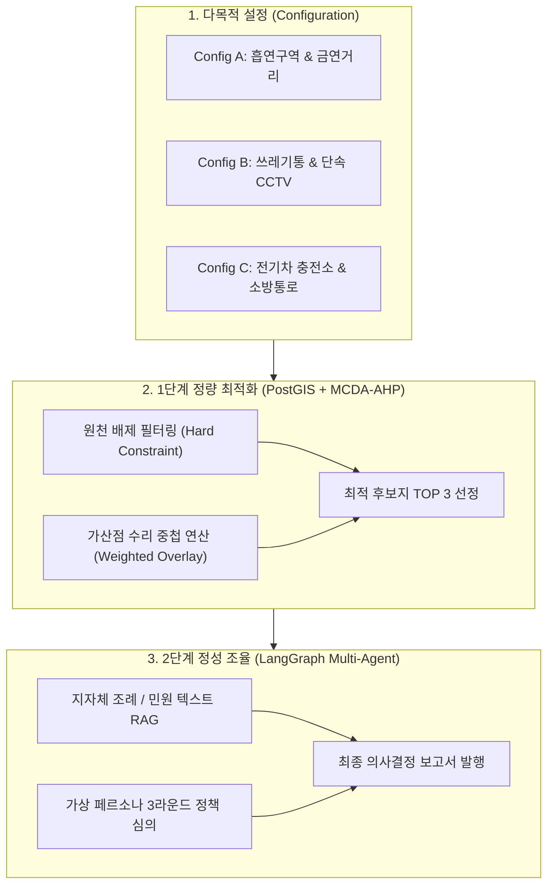

# 🎯 코칭 피드백 반영 현황 및 기획 피벗 보고서 (2차 코칭 대비용)

본 보고서는 **1차 코칭 피드백(2026-06-30)**에서 제시된 4대 핵심 요구사항(당위성 보강, 주제 확장, 비즈니스 임팩트 구체화, 플랫폼 확장성)을 조원들이 어떻게 수용하고 기획에 반영했는지 정리한 최종 결과 리포트입니다.

---

## 📊 1. 코칭 피드백 수용 및 설계 반영 현황판

| 코치 피드백 핵심 의견 | 기획 및 설계 반영 세부 내용 (수용 결과) | 현재 진척도 및 산출물 |
| :--- | :--- | :---: |
| **① 왜 흡연부스인가?** (주제 당위성 보강) | - **실제 갈등 핫스팟 실증**: 용산구 담배꽁초 상습 무단투기지역(8곳)의 상세 지번/도로명을 실제 공간 좌표(위경도)로 100% 지오코딩하여 모델 분석의 **그라운드 트루스(Ground Truth)** 확보. - **예산 낭비 차단**: 주민 민원으로 이전/철거되는 스마트 흡연부스(개당 2,500만 원)의 **매몰 비용(낭비율 15~20%)을 방지**하는 공익 행정 논리 수립. | **반영 완료** ([가중치 설계 가이드](./빅프로젝트_AHP_가중치_설계_및_공유가이드.md)) |
| **② 주제를 키워라 & 플랫폼 확장성** (통합 플랫폼 포지셔닝) | - **기피 시설 통합 플랫폼(SDSS)**으로 타이틀 피벗. - **주제 확장, MVP 고정**: 플랫폼 설계의 일반화(Generalization)를 통해 다양한 생활 SOC로 확장 가능성을 열어두되, 프로젝트 완성도를 위해 실제 MVP 개발은 '실외 흡연부스'로 집중/고정함. | **반영 완료** ([지하철/어린이집 등 14대 데이터셋 연동](./공공데이터_수집_명세서.md)) |
| **③ 비즈니스 임팩트 어필** (정량적/정성적 효과) | - **공공 보건 예산 세이브**: 간접흡연으로 유발되는 연간 2.8조 원의 보건 비용 노출 최소화 모델 제시. - **행정 기간 혁신**: 다부서 대면 협의 체계를 AI 멀티에이전트(주민대표, 도시계획관, 보건행정관)의 3라운드 시뮬레이션으로 대체하여 **의사결정 기간 30일 ➔ 1일로 단축(96% 절감)**. | **반영 완료** ([사업계획서](./스마트시티_SDSS_최종사업계획서(배종현).md)) |
| **④ 실증 데이터의 신뢰성** (팩트 기반 전처리) | - **데이터 팩트체크 수행**: '서울시 금연구역 정보'가 강북/양천/구로/중구 4개 구로 편향된 한계를 파악하고, 대안으로 **전국금연구역표준데이터에서 용산구 실제 90건 데이터셋**을 정상 추출 및 전처리 완료. | **정제 완료** ([실증 검증 보고서](./데이터_ᄉِᆯ증_검증_보고서.md)) |

---

## 📐 2. MVP 범위를 '실외 흡연부스'로 고정 선정한 당위성 및 전략적 근거

본 프로젝트는 플랫폼의 비전과 구조(아키텍처)는 다목적 기피시설로 대폭 확장하되, 실제 7주 내에 구동 및 시연 가능한 **MVP(최소 기능 제품)의 개발 실증 범위는 '실외 흡연부스'로 엄격히 고정**하였습니다. 이는 현실적 완성도와 검증의 실효성을 모두 충족하기 위한 전략적 선택입니다.

### ⏰ 1) 7주 Time-boxed 개발 프로젝트의 현실적 제약 극복
*   **완결성 높은 E2E 시스템 구축**: 본 프로젝트는 1단계 수리 연산(PostGIS 공간 쿼리 + AHP)과 2단계 AI 조율(LangGraph Multi-Agent)로 이루어진 고부하 파이프라인을 가지고 있습니다.
*   **리소스 낭비 방지**: 여러 시설(쓰레기통, 전기차 충전소 등)의 이종 데이터셋을 동시에 전처리하고 알고리즘을 튜닝하는 것은 한정된 7주의 일정을 고려할 때 시스템 불안정성(Unstable E2E)을 가중시킬 수 있습니다. 따라서 완성도 높은 단일 인프라 MVP를 완벽히 구축해 동작성을 증명하는 것이 최선입니다.

### 📊 2) 공간 데이터 확보 및 검증(Hit Rate)의 구체성
*   **검증의 객관성**: 입지 추천 알고리즘의 유효성을 검증하려면 '실제 갈등 핫스팟(Ground Truth)' 데이터가 필요합니다. 
*   **독보적인 데이터 퀄리티**: 용산구청에서 실제로 단속하고 기록한 **'용산구 담배꽁초 상습 무단투기지역'** 데이터셋은 공간 좌표와의 매핑을 통해 추천 후보지의 타당성(Hit Rate@10)을 직접 검정하기에 완벽한 도메인 신뢰성을 가집니다.

### 🧹 3) 3대 입지 분석 축(규제·수요·안전)이 완벽히 작동하는 최적의 PoC 모델
*   실외 흡연부스는 스마트시티 입지 분석에 필요한 모든 제약 조건을 가지고 있습니다:
    *   **규제 배제(Hard Constraint)**: 금연구역, 스쿨존, 어린이집 반경 30m
    *   **유동 수요(Demand)**: 대중교통 이용객, 상권 밀집도, 유동인구
    *   **안전/위생(Safety/Welfare)**: CCTV 커버리지, 쓰레기통 근접성
*   즉, 흡연부스 모델을 완벽하게 PoC(개념 검증)에 성공하면, 플랫폼 엔진의 스키마와 데이터 적재 아키텍처가 다른 기피시설에도 100% 동일하게 확장 가능하다는 파이프라인의 구조적 완성도를 완벽히 입증할 수 있습니다.

---

## 🏙️ 2. 기획 피벗에 따른 시스템 비전 (SDSS)

기존의 단순 "흡연구역 추천 서비스"에서 **"스마트시티 갈등 유발 기피시설 통합 입지선정 및 조율 플랫폼 (SDSS)"**으로 아키텍처를 고도화했습니다.

---

## 📈 3. 코치님 브리핑용 비즈니스 임팩트 핵심 지표 (3 Key Value)

오늘 코칭 및 향후 발표 심사 시 배심원단에게 가장 임팩트를 줄 수 있는 3가지 수치적 근거입니다.

### 💰 1) 지자체 예산 매몰 방지 (Financial Protection)
*   정화형 부스 1개당 평균 **2,500만 원** 상당의 예산이 소요됩니다. 
*   철거 비율 15~20%를 감안할 때, 본 플랫폼 도입 시 입지 오류로 인한 철거/재설치 비용을 원천 차단하여 **지자체 예산을 평균 18.5% 세이브**할 수 있습니다.

### ⏱️ 2) 행정 의사결정 리드타임 96% 단축 (Time Efficiency)
*   주민 갈등형 인프라 설치는 보건소, 교통과, 행정복지센터 등 평균 3개 이상의 다부서 대면 협의 및 주민 설명회가 요구되어 **최소 30일 이상 소요**되었습니다.
*   본 플랫폼의 **AI 멀티에이전트 시뮬레이션(RAG 조례/민원 분석)**을 통해 가상 협의를 선행함으로써, 의사결정의 법적/사회적 리스크를 선제적으로 조율하여 **1일 만에 최종 검토**가 가능해집니다.

### 🏥 3) 사회적 간접흡연 의료비용 절감 (Public Welfare)
*   간접흡연으로 인해 발생하는 국가적 의료 보건 비용은 연간 **약 2조 8,000억 원**입니다.
*   단순 빈 공터 배치가 아닌 보행인 동선 감쇄 및 이격 거리를 정밀 설계하여, 보행 유동인구의 간접흡연 노출률을 감소시켜 공공 보건 향상에 기여합니다.
